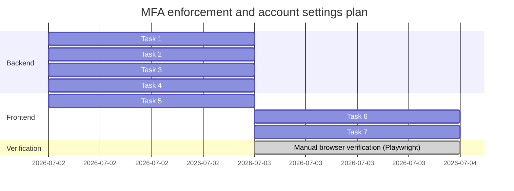

# Daily Commit & Changes Report — July 2, 2026

## 1. Executive Summary

Today's work spans two threads: infrastructure/quality hardening in the early session (TLS reverse proxy, LLM quality suite, translation and stuck-job fixes), and a complete end-to-end MFA feature (23 commits total, extending past midnight into the small hours of July 3 GMT+7 as one continuous working session). The MFA thread shipped org-wide MFA enforcement (an admin toggle previously unreachable despite the underlying column existing) and a self-service account settings page, closed a real pre-existing security gap (`/api/v1/mfa/disable` had no mandatory-MFA check at all), fixed two secret-exposure findings from automated security review (TOTP provisioning URI leaking to a third-party charting API in both `account.html` and `login.html`), fixed an unrelated pre-existing test bug uncovered along the way, and closed with full manual browser verification — which caught and fixed one more real regression (a QR code layout overflow) before being called done.

---

## 2. Commit Log Overview

Chronological list of all commits integrated today (July 2–3, 2026, one continuous session):

| Commit Hash | Author Date (GMT+7) | Type | Summary | Affected Files |
| :--- | :--- | :--- | :--- | :--- |
| **`6d10f51`** | 07-02 14:05:45 | `fix` | Age-gate stuck-job cleanup instead of failing every in-flight job | `ldv-backend/database.py` |
| **`7bd270a`** | 07-02 14:05:52 | `fix` | Resolve silent local translation failure from missing `sentencepiece` | `docker-compose.yml`, `ldv-backend/requirements.txt` |
| **`b8d46b5`** | 07-02 14:05:58 | `test` | Add LLM quality suite covering the 9 previously-pending sections | `ldv-backend/tests/llm_quality_results.json`, `ldv-backend/tests/test_llm_quality.py` |
| **`0f30280`** | 07-02 14:36:53 | `chore` | Gitignore `deploy/certs/` to avoid committing active private keys | `.gitignore` |
| **`32c4df7`** | 07-02 14:36:59 | `feat` | Add nginx TLS reverse-proxy config and self-signed cert script | `deploy/gen-cert.sh`, `deploy/nginx.conf`, `docs/2026-07-01.md` |
| **`fb3db41`** | 07-02 15:06:16 | `docs` | Add design spec for MFA enforcement toggle + account settings page | `docs/superpowers/specs/2026-07-02-mfa-enforcement-account-settings-design.md` |
| **`5d2da36`** | 07-02 15:15:20 | `docs` | Add implementation plan for MFA enforcement toggle + account settings | `docs/superpowers/plans/2026-07-02-mfa-enforcement-account-settings.md` |
| **`9445132`** | 07-02 15:16:58 | `feat` | Tag `document_type` source as classifier vs user_selected; expand `manage.py` role choices | `CLAUDE.md`, `ldv-backend/app.py`, `ldv-backend/detector/detector_distilbert.py`, `ldv-backend/manage.py` |
| **`1fb14d9`** | 07-02 15:20:43 | `feat` | Add `database.set_org_mfa_required` write path (Task 1) | `ldv-backend/database.py`, `ldv-backend/tests/test_org_mfa_required.py` |
| **`6a5a7d1`** | 07-02 15:29:15 | `feat` | Add admin endpoint to toggle org-wide MFA enforcement (Task 2) | `ldv-backend/app.py`, `ldv-backend/tests/test_mfa_enforcement.py` |
| **`ec74a19`** | 07-02 19:55:39 | `fix` | Bypass `/login` MFA-mandatory gate in mfa-required endpoint tests | `ldv-backend/tests/test_mfa_enforcement.py` |
| **`c61d625`** | 07-02 20:05:56 | `fix` | Enforce mandatory MFA on the `/api/v1/mfa/disable` endpoint (Task 3) | `ldv-backend/app.py` |
| **`a257856`** | 07-02 20:10:38 | `feat` | Add `/account` route for self-service security settings (Task 4) | `ldv-backend/app.py` |
| **`f7ac322`** | 07-02 20:16:38 | `feat` | Add self-service MFA account settings page (Task 5) | `ldv-frontend/account.html` |
| **`c2ab557`** | 07-02 20:23:32 | `fix` | Render MFA QR code client-side instead of leaking secret to `chart.googleapis.com` | `ldv-frontend/account.html` |
| **`b427d9e`** | 07-02 20:24:13 | `fix` | Add SRI hash to `qrcode-generator` CDN script tag | `ldv-frontend/account.html` |
| **`b1a622d`** | 07-03 00:58:01 | `feat` | Add MFA enforcement toggle to admin Organizations tab (Task 6) | `ldv-frontend/admin.html` |
| **`73c4ba3`** | 07-03 01:01:43 | `feat` | Link MFA banner and admin sidebar to the account settings page (Task 7) | `ldv-frontend/admin.html`, `ldv-frontend/index.html` |
| **`0e25014`** | 07-03 01:12:46 | `fix` | Render MFA QR code client-side in `login.html` (same fix as `account.html`) | `ldv-frontend/login.html` |
| **`932a341`** | 07-03 01:16:05 | `fix` | Bypass `/login` MFA-mandatory gate in `test_auth.py`'s admin fixture | `ldv-backend/tests/test_auth.py` |
| **`9344dd9`** | 07-03 01:34:50 | `docs` | Mark MFA enforcement UI as DONE in CLAUDE.md | `CLAUDE.md` |
| **`6c013b4`** | 07-03 01:38:53 | `docs` | Mark org/user management UI as DONE in CLAUDE.md | `CLAUDE.md` |
| **`69dd596`** | 07-03 01:53:02 | `fix` | Constrain client-side QR SVG to its intended 160×160 box | `ldv-frontend/account.html`, `ldv-frontend/login.html` |

---

## 3. Technical Deep-Dive

### 3.1. MFA Enforcement Toggle + Self-Service Account Settings (full feature, Tasks 1–7)

Brainstormed, spec'd, planned, and executed via subagent-driven development. The design audit found that CLAUDE.md's "MFA enforcement UI, org/user management UI" TODO was stale — `admin.html` already had full Team/Organizations management UI, and `login.html` already had the complete MFA enrollment/challenge flow. The two real gaps were: `organizations.mfa_required` had no write path despite `auth.is_mfa_mandatory()` already reading it, and there was no self-service page for a user to opt into MFA voluntarily.

* **Task 1 (`1fb14d9`):** `database.set_org_mfa_required(org_id, required)`, mirroring the existing `set_org_retention`. Added `org.mfa_required_change` to the audit high-impact-actions allowlist.
* **Task 2 (`6a5a7d1`, fixed by `ec74a19`):** `POST /api/v1/admin/organizations/<org_id>/mfa-required`, same manager/admin org-scoping as the retention endpoint. Mid-task, the implementer found the plan's own test fixture collided with a pre-existing rule (`is_mfa_mandatory()` makes MFA unconditionally mandatory for admin/reviewer/manager roles) — fixed by bypassing `/login` via `session_transaction()` in the 3 affected test functions, not touching production auth code.
* **Task 3 (`c61d625`):** Closed a real security gap found during planning — `/api/v1/mfa/disable` had **no check at all** for mandatory MFA, so a user in an enforced org/role could silently disable their own MFA and defeat Tasks 1–2. Fixed by reusing the exact guard already on `/api/v1/mfa/skip`.
* **Task 4 (`a257856`):** `GET /account` route, same `auth.current_user()` guard pattern as `/admin` and `/citations`.
* **Task 5 (`f7ac322`, fixed by `c2ab557` + `b427d9e`):** `ldv-frontend/account.html` — status/enable/enroll/disable views reusing the existing `/api/v1/mfa/{status,setup,enable,disable}` endpoints, zero new backend logic. Automated security review flagged the plan's own QR-rendering snippet (copied from `login.html`) as sending the TOTP provisioning URI — which embeds the raw secret — to `chart.googleapis.com`; fixed by rendering the QR entirely client-side via a version-pinned, SRI-hashed `qrcode-generator` CDN library. A follow-up scan then flagged the new CDN tag's missing SRI, which was added immediately after.
* **Task 6 (`b1a622d`):** "MFA Enforcement" toggle column in `admin.html`'s Organizations tab, POSTing to the Task 2 endpoint immediately on click.
* **Task 7 (`73c4ba3`):** Linked `index.html`'s existing MFA warning banner and added an "Account & Security" sidebar link in `admin.html`, both pointing at `/account`.

**Post-ship fixes requested by the user:**
* **`0e25014`:** The `chart.googleapis.com` secret leak also existed in `login.html` (the *primary* enrollment path, higher-traffic than `account.html`) — same client-side-QR fix applied.
* **`932a341`:** While running the full test suite as a final check, `tests/test_auth.py::test_owner_and_cross_org_and_admin` failed. Verified via an isolated worktree that this failure **pre-dates the entire MFA plan** (same root cause: admin role's unconditional MFA-mandatory rule colliding with a login-based test fixture) — fixed with the same `session_transaction()` bypass pattern.
* **`9344dd9`, `6c013b4`:** Marked both CLAUDE.md TODO items DONE with implementation detail.
* **`69dd596`:** Manual browser verification (Playwright) caught a real regression the automated tests couldn't: the client-side QR `<svg>` carries its own `184px` width/height attributes with no CSS constraint, overflowing its intended 160×160 box and clipping the neighboring "Scan QR Code" text and manual-entry key. Fixed by constraining the container and forcing the injected SVG to fill it.

**Full manual verification performed** (Playwright against a throwaway dev DB): admin MFA-enforcement toggle click → persists across a genuine fresh login+navigation; forced enrollment flow for admin and manager fixtures (QR renders as a real scannable inline SVG, TOTP computed and verified); `/api/v1/mfa/disable` correctly blocked with an inline error for a mandatory-role user; full voluntary enable→disable cycle for a non-mandatory analyst user, end to end.

### 3.2. Security, Containerization & Routing Hardening
*   **TLS Reverse Proxy (`32c4df7` & `0f30280`):** Nginx config (`deploy/nginx.conf`) enforcing HSTS, `X-Frame-Options: DENY`, `X-Content-Type-Options: nosniff`; auto-redirects HTTP (80) to HTTPS (443).
*   **Certificate Provisioning:** `deploy/gen-cert.sh` bootstraps self-signed dev/staging certs; `deploy/certs/` gitignored.
*   **Shared Rate-Limiter:** Redis service added in `docker-compose.yml` for global rate-limit counters (survives worker reloads).
*   **Nginx Timeouts:** `proxy_read_timeout`/`proxy_send_timeout` raised to `360s` for slow ML inference.

### 3.3. Quality & ML Infrastructure Fixes
*   **Local Translation Dependency (`7bd270a`):** Added missing `sentencepiece==0.2.1` and `sacremoses==0.1.1` so offline Helsinki-NLP translation no longer silently no-ops.
*   **LLM Verification Suite (`b8d46b5`):** `ldv-backend/tests/test_llm_quality.py` covering translation, classification accuracy, and monotonic risk-score degradation under Qwen3-1.7B.
*   **Classifier Metadata (`9445132`):** `document_type.source` distinguishes `"classifier"` (real ML confidence) from `"user_selected"` (manual override) for audit-trail accuracy.
*   **User Provisioning Roles:** `manage.py create-user --role` now accepts `analyst`/`reviewer`/`manager` in addition to `user`/`admin`.

### 3.4. System Stability Fixes
*   **Safe Stuck-Job Cleanup (`6d10f51`):** Startup cleanup now only targets jobs older than 30 minutes instead of aborting every running/queued task.
    > [!NOTE]
    > *ponytail:* Age-gated cleanup assumes a hard ML execution timeout limit of 330s. If any future job legitimately executes for >30 minutes, a per-worker lease system must be implemented.

---

## 4. Current State & Next Steps

All 23 commits are on `master` (trunk-based, no feature branch), workspace clean. The MFA enforcement + account settings plan is **fully complete and manually verified**:

**Follow-ups tracked, not blocking:**
- None remaining from the MFA feature itself — all findings from code review, security scans, and manual verification were fixed within this session.

**Next step (triaged 2026-07-03):** All CLAUDE.md P0–P3 TODOs are verified done in code (Docker, role provisioning, async worker, citation-verify endpoint, MFA enforcement all confirmed present, not just doc-claimed). Checked remaining work against the PRD's release gates (`docs/2026-06-22-PRD.md` §19) instead of the engineering TODO list, since that's now exhausted:
- **Gate 5 (Quality) — already built:** PDF/plaintext report export exists as `ldv-backend/pdf_report.py` (reportlab-based, wired to `POST /api/v1/report`), not `pdf_export.py` as Feature Roadmap R3 implied — that name was stale.
- **Gate 2 (Legal content) — blocked on people, not code:** `legal_citations.csv` is still mostly `draft` trust status (only 21 ID citations lawyer-verified; FR/BE and all red-flag citations remain unverified). Not actionable by engineering alone.
