# Gold Standard Validation Traceability Matrix

**Role**: Legal-data and Content Owner (Ilham)  
**Repository**: Contract Risk Analyzer (CRA)  
**Purpose**: End-to-End Evidence Lineage for All 56 Canonical Contract Profiles in `registry_v1.json`  

---

## Registry Profile: `employment_contract` — Employment Contract

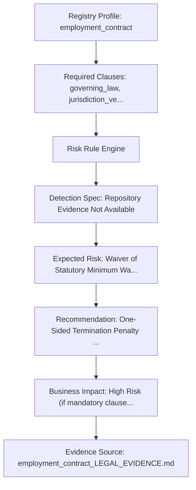

| Traceability Node | Repository Evidence Detail |
| :--- | :--- |
| **Validation ID** | `VAL-001` |
| **Registry Profile ID** | `employment_contract` (Employment Contract) — Family: `employment_agreements` |
| **Supported Languages** | `id, fr, nl, en` |
| **Validation Scenario Metadata** | `1 (1 Primary Audit)` |
| **Required Clauses** | `governing_law, jurisdiction_venue, termination, notice_period, compensation, working_hours, dispute_resolution` |
| **Recommended Clauses** | `indemnification, confidentiality, dispute_resolution, force_majeure` |
| **Dangerous Clauses** | `governing_law, jurisdiction_venue, termination, notice_period, compensation, working_hours, dispute_resolution` |
| **Abusive Clauses** | `indemnification, confidentiality, dispute_resolution, force_majeure` |
| **Illegal Clauses** | `Unlimited Non-Compete Scope, Unilateral Salary Reduction, Excessive Probation Period` |
| **Leonine Clauses** | `Unilateral Modification of Terms, Mandatory Waiver of Overtime Pay` |
| **Expected Risk** | **Waiver of Statutory Minimum Wage, Waiver of Sexual Harassment Protections (UU 13/2003 Art. 86/90)** |
| **Expected Recommendation** | One-Sided Termination Penalty Only on Employee |
| **Expected Business Impact** | High Risk (if mandatory clauses missing / dangerous clauses detected) |
| **Detection Specification** | `Repository Evidence Not Available` |
| **Legal Evidence Source** | `docs/lightml/legal_profile_evidence/employment_contract_LEGAL_EVIDENCE.md` |
| **Engineering Implementation** | `Active Implementation Available (employment_contract.json)` |
| **Reviewer Required** | Legal-data and Content Owner (Ilham) / Qualified Legal Reviewer |
| **Repository Status** | **Complete (Beta Candidate)** |
| **Repository Notes** | Canonical profile in registry_v1.json; active JSON schema & legal evidence present. |

---

## Registry Profile: `lease_agreement` — Lease Agreement

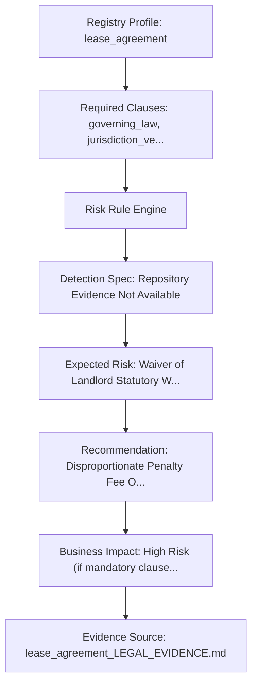

| Traceability Node | Repository Evidence Detail |
| :--- | :--- |
| **Validation ID** | `VAL-002` |
| **Registry Profile ID** | `lease_agreement` (Lease Agreement) — Family: `property_agreements` |
| **Supported Languages** | `id, fr, nl, en` |
| **Validation Scenario Metadata** | `1 (1 Primary Audit)` |
| **Required Clauses** | `governing_law, jurisdiction_venue, lease_term, rent_amount, security_deposit, maintenance_responsibility, termination, dispute_resolution` |
| **Recommended Clauses** | `insurance, security_deposit, quiet_enjoyment, force_majeure` |
| **Dangerous Clauses** | `governing_law, jurisdiction_venue, lease_term, rent_amount, security_deposit, maintenance_responsibility, termination, dispute_resolution` |
| **Abusive Clauses** | `insurance, security_deposit, quiet_enjoyment, force_majeure` |
| **Illegal Clauses** | `Unilateral Forfeiture of Security Deposit, Automatic Annual Rent Increase Without Cap` |
| **Leonine Clauses** | `Unilateral Eviction Without Court Process, Landlord Right to Alter Premises Unilaterally` |
| **Expected Risk** | **Waiver of Landlord Statutory Warranty of Quiet Enjoyment (KUHPerdata Art. 1550 / Code civil Art. 1719)** |
| **Expected Recommendation** | Disproportionate Penalty Fee Only on Tenant Default |
| **Expected Business Impact** | High Risk (if mandatory clauses missing / dangerous clauses detected) |
| **Detection Specification** | `Repository Evidence Not Available` |
| **Legal Evidence Source** | `docs/lightml/legal_profile_evidence/lease_agreement_LEGAL_EVIDENCE.md` |
| **Engineering Implementation** | `Active Implementation Available (lease_agreement.json)` |
| **Reviewer Required** | Legal-data and Content Owner (Ilham) / Qualified Legal Reviewer |
| **Repository Status** | **Complete (Beta Candidate)** |
| **Repository Notes** | Canonical profile in registry_v1.json; active JSON schema & legal evidence present. |

---

## Registry Profile: `software_license` — Software License Agreement

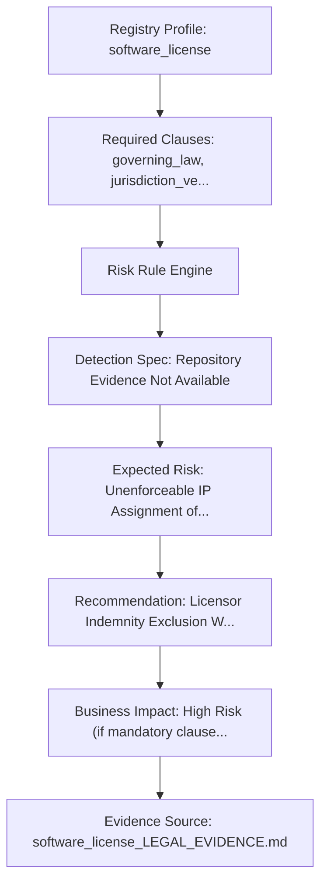

| Traceability Node | Repository Evidence Detail |
| :--- | :--- |
| **Validation ID** | `VAL-003` |
| **Registry Profile ID** | `software_license` (Software License Agreement) — Family: `commercial_agreements` |
| **Supported Languages** | `en, id, nl, fr` |
| **Validation Scenario Metadata** | `2 (1 Primary Audit + 1 Schema Sync)` |
| **Required Clauses** | `governing_law, jurisdiction_venue, license_grant, ip_ownership, limitation_liability, warranty_disclaimer, termination, dispute_resolution` |
| **Recommended Clauses** | `support_maintenance, sla, data_protection, force_majeure` |
| **Dangerous Clauses** | `governing_law, jurisdiction_venue, license_grant, ip_ownership, limitation_liability, warranty_disclaimer, termination, dispute_resolution` |
| **Abusive Clauses** | `support_maintenance, sla, data_protection, force_majeure` |
| **Illegal Clauses** | `Unilateral Audit Rights Without Prior Notice, Immediate Termination Without Cure Period` |
| **Leonine Clauses** | `Complete Disclaimer of All Liability Including Gross Negligence` |
| **Expected Risk** | **Unenforceable IP Assignment of Pre-existing Works (UU Hak Cipta No. 28/2014)** |
| **Expected Recommendation** | Licensor Indemnity Exclusion While Licensee Holds Full Indemnity Burden |
| **Expected Business Impact** | High Risk (if mandatory clauses missing / dangerous clauses detected) |
| **Detection Specification** | `Repository Evidence Not Available` |
| **Legal Evidence Source** | `docs/lightml/legal_profile_evidence/software_license_LEGAL_EVIDENCE.md` |
| **Engineering Implementation** | `Active Implementation Available (software_license.json & saas_agreement.json)` |
| **Reviewer Required** | Legal-data and Content Owner (Ilham) / Qualified Legal Reviewer |
| **Repository Status** | **Complete (Beta Candidate)** |
| **Repository Notes** | Canonical profile in registry_v1.json; active JSON schema & legal evidence present. |

---

## Registry Profile: `service_agreement` — Service Agreement

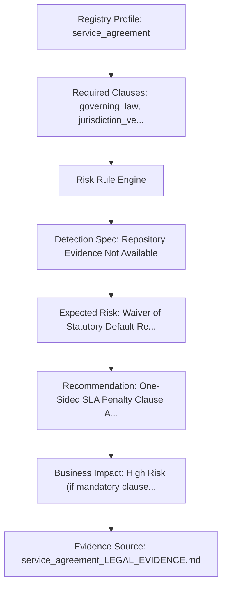

| Traceability Node | Repository Evidence Detail |
| :--- | :--- |
| **Validation ID** | `VAL-004` |
| **Registry Profile ID** | `service_agreement` (Service Agreement) — Family: `commercial_agreements` |
| **Supported Languages** | `id, fr, nl, en` |
| **Validation Scenario Metadata** | `1 (1 Primary Audit)` |
| **Required Clauses** | `governing_law, jurisdiction_venue, scope_of_services, payment_terms, termination, limitation_liability, dispute_resolution` |
| **Recommended Clauses** | `indemnification, confidentiality, force_majeure, intellectual_property` |
| **Dangerous Clauses** | `governing_law, jurisdiction_venue, scope_of_services, payment_terms, termination, limitation_liability, dispute_resolution` |
| **Abusive Clauses** | `indemnification, confidentiality, force_majeure, intellectual_property` |
| **Illegal Clauses** | `Uncapped Liquidated Damages for Service Delay, Unlimited Liability for Indirect Damages` |
| **Leonine Clauses** | `Unilateral Right to Change Service Levels Without Compensation` |
| **Expected Risk** | **Waiver of Statutory Default Remedies (KUHPerdata Art. 1243)** |
| **Expected Recommendation** | One-Sided SLA Penalty Clause Applying Only to Provider |
| **Expected Business Impact** | High Risk (if mandatory clauses missing / dangerous clauses detected) |
| **Detection Specification** | `Repository Evidence Not Available` |
| **Legal Evidence Source** | `docs/lightml/legal_profile_evidence/service_agreement_LEGAL_EVIDENCE.md` |
| **Engineering Implementation** | `Active Implementation Available (service_agreement.json)` |
| **Reviewer Required** | Legal-data and Content Owner (Ilham) / Qualified Legal Reviewer |
| **Repository Status** | **Complete (Beta Candidate)** |
| **Repository Notes** | Canonical profile in registry_v1.json; active JSON schema & legal evidence present. |

---

## Registry Profile: `consulting_agreement` — Consulting Agreement

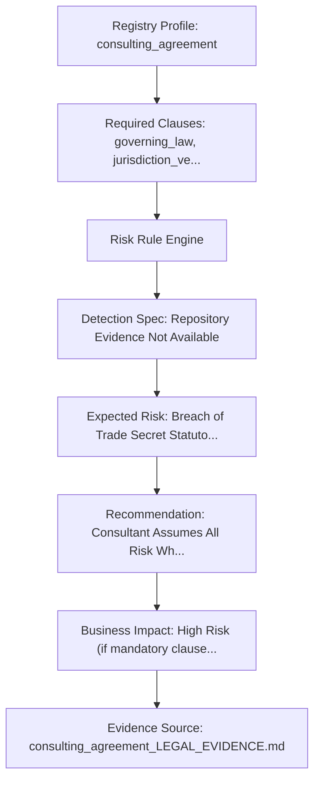

| Traceability Node | Repository Evidence Detail |
| :--- | :--- |
| **Validation ID** | `VAL-005` |
| **Registry Profile ID** | `consulting_agreement` (Consulting Agreement) — Family: `commercial_agreements` |
| **Supported Languages** | `id, fr, nl, en` |
| **Validation Scenario Metadata** | `1 (1 Primary Audit)` |
| **Required Clauses** | `governing_law, jurisdiction_venue, scope_of_services, payment_terms, confidentiality, termination, dispute_resolution` |
| **Recommended Clauses** | `non_solicitation, confidentiality, ip_assignment, force_majeure` |
| **Dangerous Clauses** | `governing_law, jurisdiction_venue, scope_of_services, payment_terms, confidentiality, termination, dispute_resolution` |
| **Abusive Clauses** | `non_solicitation, confidentiality, ip_assignment, force_majeure` |
| **Illegal Clauses** | `Non-Solicitation Extending Indefinitely, Uncapped Indemnity for Advisory Advice` |
| **Leonine Clauses** | `Client Ownership of Pre-existing Consultant Background IP` |
| **Expected Risk** | **Breach of Trade Secret Statutory Protection (UU 30/2000)** |
| **Expected Recommendation** | Consultant Assumes All Risk While Client Claims All IP and Profit |
| **Expected Business Impact** | High Risk (if mandatory clauses missing / dangerous clauses detected) |
| **Detection Specification** | `Repository Evidence Not Available` |
| **Legal Evidence Source** | `docs/lightml/legal_profile_evidence/consulting_agreement_LEGAL_EVIDENCE.md` |
| **Engineering Implementation** | `Active Implementation Available (consulting_agreement.json)` |
| **Reviewer Required** | Legal-data and Content Owner (Ilham) / Qualified Legal Reviewer |
| **Repository Status** | **Complete (Beta Candidate)** |
| **Repository Notes** | Canonical profile in registry_v1.json; active JSON schema & legal evidence present. |

---

## Registry Profile: `commercial_agreement` — Commercial Agreement

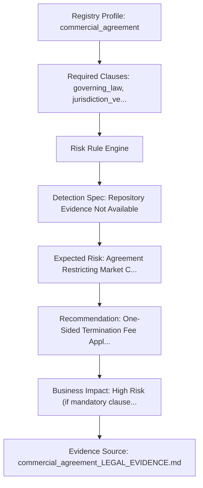

| Traceability Node | Repository Evidence Detail |
| :--- | :--- |
| **Validation ID** | `VAL-006` |
| **Registry Profile ID** | `commercial_agreement` (Commercial Agreement) — Family: `commercial_agreements` |
| **Supported Languages** | `id, fr, nl, en` |
| **Validation Scenario Metadata** | `1 (1 Primary Audit)` |
| **Required Clauses** | `governing_law, jurisdiction_venue, payment_terms, termination, limitation_liability, dispute_resolution` |
| **Recommended Clauses** | `indemnification, force_majeure, limitation_liability, confidentiality` |
| **Dangerous Clauses** | `governing_law, jurisdiction_venue, payment_terms, termination, limitation_liability, dispute_resolution` |
| **Abusive Clauses** | `indemnification, force_majeure, limitation_liability, confidentiality` |
| **Illegal Clauses** | `Broad Uncapped Liability Clause, Automatic Contract Renewal Without Notice` |
| **Leonine Clauses** | `Unilateral Price Increase Right Without Termination Option` |
| **Expected Risk** | **Agreement Restricting Market Competition (UU 5/1999 Monopoly Law)** |
| **Expected Recommendation** | One-Sided Termination Fee Applicable to One Party Only |
| **Expected Business Impact** | High Risk (if mandatory clauses missing / dangerous clauses detected) |
| **Detection Specification** | `Repository Evidence Not Available` |
| **Legal Evidence Source** | `docs/lightml/legal_profile_evidence/commercial_agreement_LEGAL_EVIDENCE.md` |
| **Engineering Implementation** | `Active Implementation Available (commercial_agreement.json)` |
| **Reviewer Required** | Legal-data and Content Owner (Ilham) / Qualified Legal Reviewer |
| **Repository Status** | **Complete (Beta Candidate)** |
| **Repository Notes** | Canonical profile in registry_v1.json; active JSON schema & legal evidence present. |

---

## Registry Profile: `non_disclosure_agreement` — Non-Disclosure Agreement

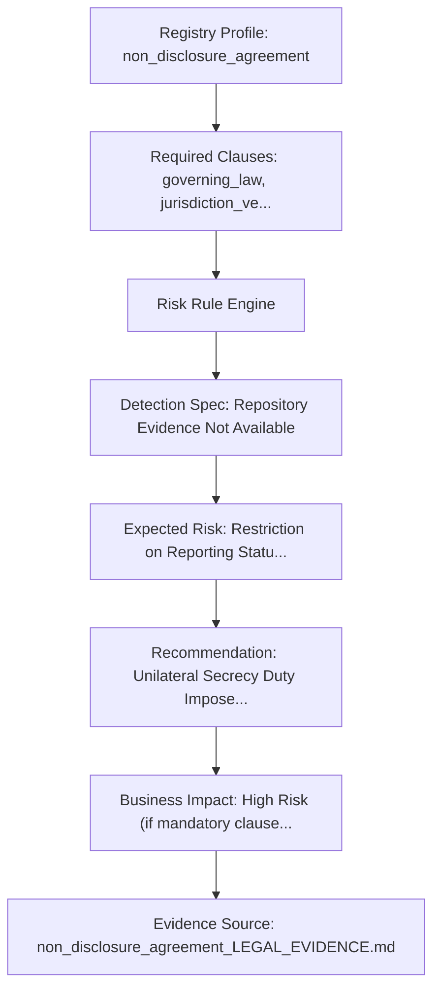

| Traceability Node | Repository Evidence Detail |
| :--- | :--- |
| **Validation ID** | `VAL-007` |
| **Registry Profile ID** | `non_disclosure_agreement` (Non-Disclosure Agreement) — Family: `commercial_agreements` |
| **Supported Languages** | `id, fr, nl, en` |
| **Validation Scenario Metadata** | `1 (1 Primary Audit)` |
| **Required Clauses** | `governing_law, jurisdiction_venue, confidentiality, termination, return_of_materials, dispute_resolution` |
| **Recommended Clauses** | `injunctive_relief, return_of_materials, term_of_secrecy` |
| **Dangerous Clauses** | `governing_law, jurisdiction_venue, confidentiality, termination, return_of_materials, dispute_resolution` |
| **Abusive Clauses** | `injunctive_relief, return_of_materials, term_of_secrecy` |
| **Illegal Clauses** | `Perpetual Confidentiality Obligation Without Exclusion, Excessive Liquidated Damages` |
| **Leonine Clauses** | `Overly Broad Definition of Confidential Info Including Public Knowledge` |
| **Expected Risk** | **Restriction on Reporting Statutory Crimes / Whistleblowing** |
| **Expected Recommendation** | Unilateral Secrecy Duty Imposed On Receiving Party Only |
| **Expected Business Impact** | High Risk (if mandatory clauses missing / dangerous clauses detected) |
| **Detection Specification** | `Repository Evidence Not Available` |
| **Legal Evidence Source** | `docs/lightml/legal_profile_evidence/non_disclosure_agreement_LEGAL_EVIDENCE.md` |
| **Engineering Implementation** | `Active Implementation Available (non_disclosure_agreement.json)` |
| **Reviewer Required** | Legal-data and Content Owner (Ilham) / Qualified Legal Reviewer |
| **Repository Status** | **Complete (Beta Candidate)** |
| **Repository Notes** | Canonical profile in registry_v1.json; active JSON schema & legal evidence present. |

---

## Registry Profile: `loan_agreement` — Loan Agreement

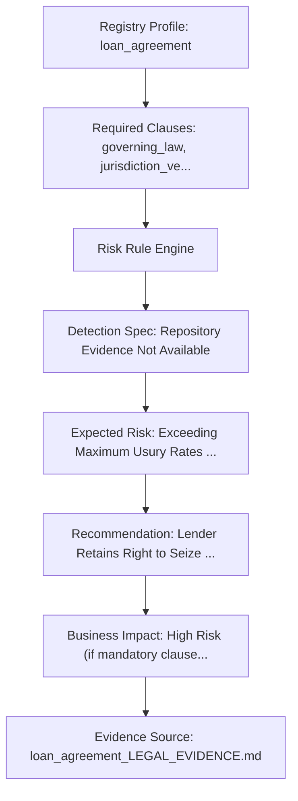

| Traceability Node | Repository Evidence Detail |
| :--- | :--- |
| **Validation ID** | `VAL-008` |
| **Registry Profile ID** | `loan_agreement` (Loan Agreement) — Family: `corporate_agreements` |
| **Supported Languages** | `id, fr, nl, en` |
| **Validation Scenario Metadata** | `1 (1 Primary Audit)` |
| **Required Clauses** | `governing_law, jurisdiction_venue, principal_amount, interest_rate, repayment_schedule, default_provisions, termination, dispute_resolution` |
| **Recommended Clauses** | `prepayment_terms, collateral, financial_covenants, default_notice` |
| **Dangerous Clauses** | `governing_law, jurisdiction_venue, principal_amount, interest_rate, repayment_schedule, default_provisions, termination, dispute_resolution` |
| **Abusive Clauses** | `prepayment_terms, collateral, financial_covenants, default_notice` |
| **Illegal Clauses** | `Usurious Interest Rate Exceeding Statutory Limit, Cross-Default Triggering Instant Acceleration` |
| **Leonine Clauses** | `Unilateral Compound Interest Calculation Without Prior Written Notice` |
| **Expected Risk** | **Exceeding Maximum Usury Rates / Unlicensed Lending Activity (OJK Regulations)** |
| **Expected Recommendation** | Lender Retains Right to Seize Assets Without Foreclosure Process |
| **Expected Business Impact** | High Risk (if mandatory clauses missing / dangerous clauses detected) |
| **Detection Specification** | `Repository Evidence Not Available` |
| **Legal Evidence Source** | `docs/lightml/legal_profile_evidence/loan_agreement_LEGAL_EVIDENCE.md` |
| **Engineering Implementation** | `Active Implementation Available (loan_agreement.json)` |
| **Reviewer Required** | Legal-data and Content Owner (Ilham) / Qualified Legal Reviewer |
| **Repository Status** | **Complete (Beta Candidate)** |
| **Repository Notes** | Canonical profile in registry_v1.json; active JSON schema & legal evidence present. |

---

## Registry Profile: `partnership_agreement` — Partnership Agreement

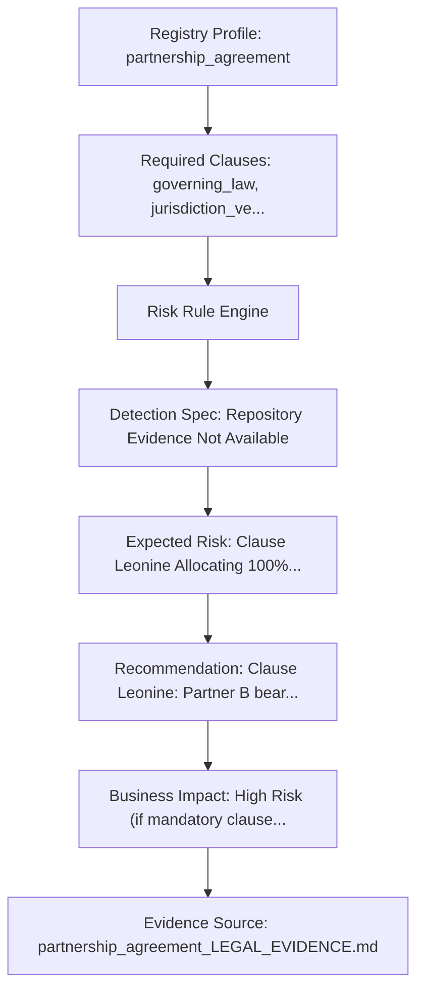

| Traceability Node | Repository Evidence Detail |
| :--- | :--- |
| **Validation ID** | `VAL-009` |
| **Registry Profile ID** | `partnership_agreement` (Partnership Agreement) — Family: `corporate_agreements` |
| **Supported Languages** | `id, fr, nl, en` |
| **Validation Scenario Metadata** | `1 (1 Primary Audit)` |
| **Required Clauses** | `governing_law, jurisdiction_venue, capital_contribution, profit_sharing, management_rights, termination, dispute_resolution` |
| **Recommended Clauses** | `capital_contributions, profit_sharing, exit_mechanism, dispute_resolution` |
| **Dangerous Clauses** | `governing_law, jurisdiction_venue, capital_contribution, profit_sharing, management_rights, termination, dispute_resolution` |
| **Abusive Clauses** | `capital_contributions, profit_sharing, exit_mechanism, dispute_resolution` |
| **Illegal Clauses** | `Unlimited Personal Liability for Partner Debts, Deadlock Provision Without Buyout Mechanism` |
| **Leonine Clauses** | `Unilateral Exclusion of Partner From Management and Inspection of Books` |
| **Expected Risk** | **Clause Leonine Allocating 100% Profits to One Partner (Code civil Art. 1844-1 / KUHPerdata Art. 1635)** |
| **Expected Recommendation** | Clause Leonine: Partner B bears 100% losses but receives 0% profits |
| **Expected Business Impact** | High Risk (if mandatory clauses missing / dangerous clauses detected) |
| **Detection Specification** | `Repository Evidence Not Available` |
| **Legal Evidence Source** | `docs/lightml/legal_profile_evidence/partnership_agreement_LEGAL_EVIDENCE.md` |
| **Engineering Implementation** | `Active Implementation Available (partnership_agreement.json)` |
| **Reviewer Required** | Legal-data and Content Owner (Ilham) / Qualified Legal Reviewer |
| **Repository Status** | **Complete (Beta Candidate)** |
| **Repository Notes** | Canonical profile in registry_v1.json; active JSON schema & legal evidence present. |

---

## Registry Profile: `purchase_agreement` — Purchase Agreement

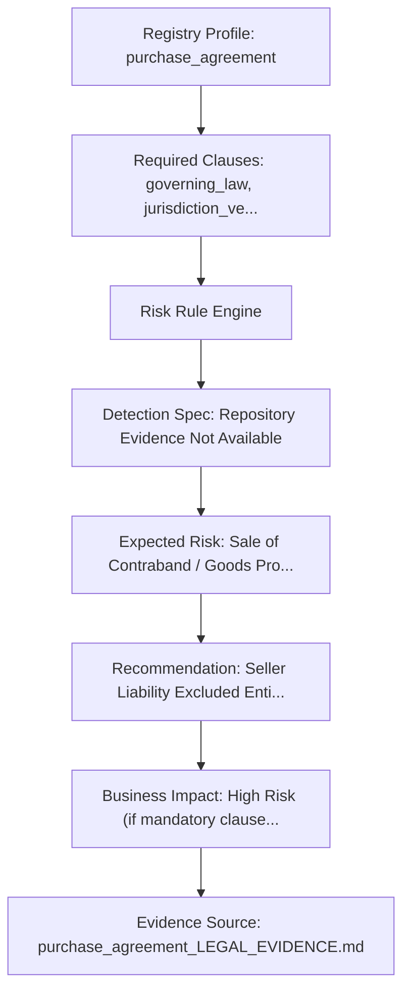

| Traceability Node | Repository Evidence Detail |
| :--- | :--- |
| **Validation ID** | `VAL-010` |
| **Registry Profile ID** | `purchase_agreement` (Purchase Agreement) — Family: `commercial_agreements` |
| **Supported Languages** | `id, fr, nl, en` |
| **Validation Scenario Metadata** | `1 (1 Primary Audit)` |
| **Required Clauses** | `governing_law, jurisdiction_venue, goods_description, payment_terms, delivery_terms, warranty, title_transfer, dispute_resolution` |
| **Recommended Clauses** | `inspection_rights, delivery_terms, warranty_period, title_transfer` |
| **Dangerous Clauses** | `governing_law, jurisdiction_venue, goods_description, payment_terms, delivery_terms, warranty, title_transfer, dispute_resolution` |
| **Abusive Clauses** | `inspection_rights, delivery_terms, warranty_period, title_transfer` |
| **Illegal Clauses** | `Disclaimer of Title Warranty, Risk of Loss Transferring Before Delivery` |
| **Leonine Clauses** | `Buyer Waives Right to Inspect Delivered Goods Upon Receipt` |
| **Expected Risk** | **Sale of Contraband / Goods Prohibited by Law** |
| **Expected Recommendation** | Seller Liability Excluded Entirely While Buyer Bears All Transit Risk |
| **Expected Business Impact** | High Risk (if mandatory clauses missing / dangerous clauses detected) |
| **Detection Specification** | `Repository Evidence Not Available` |
| **Legal Evidence Source** | `docs/lightml/legal_profile_evidence/purchase_agreement_LEGAL_EVIDENCE.md` |
| **Engineering Implementation** | `Active Implementation Available (purchase_agreement.json)` |
| **Reviewer Required** | Legal-data and Content Owner (Ilham) / Qualified Legal Reviewer |
| **Repository Status** | **Complete (Beta Candidate)** |
| **Repository Notes** | Canonical profile in registry_v1.json; active JSON schema & legal evidence present. |

---

## Registry Profile: `distribution_agreement` — Distribution Agreement

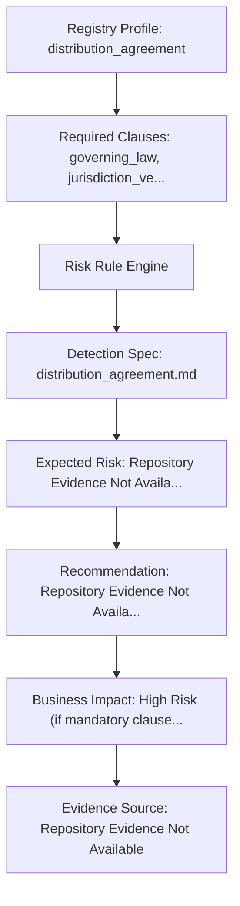

| Traceability Node | Repository Evidence Detail |
| :--- | :--- |
| **Validation ID** | `VAL-011` |
| **Registry Profile ID** | `distribution_agreement` (Distribution Agreement) — Family: `commercial_agreements` |
| **Supported Languages** | `id, fr, nl, en` |
| **Validation Scenario Metadata** | `1 (1 Primary Audit)` |
| **Required Clauses** | `governing_law, jurisdiction_venue, scope_of_services, payment_terms, termination, limitation_liability, dispute_resolution` |
| **Recommended Clauses** | `territory_exclusivity, minimum_orders, marketing_support, ip_license` |
| **Dangerous Clauses** | `governing_law, jurisdiction_venue, scope_of_services, payment_terms, termination, limitation_liability, dispute_resolution` |
| **Abusive Clauses** | `territory_exclusivity, minimum_orders, marketing_support, ip_license` |
| **Illegal Clauses** | `Repository Evidence Not Available` |
| **Leonine Clauses** | `Repository Evidence Not Available` |
| **Expected Risk** | **Repository Evidence Not Available** |
| **Expected Recommendation** | Repository Evidence Not Available |
| **Expected Business Impact** | High Risk (if mandatory clauses missing / general risk rule triggered) |
| **Detection Specification** | `docs/lightml/detection_specifications/distribution_agreement.md` |
| **Legal Evidence Source** | `Repository Evidence Not Available` |
| **Engineering Implementation** | `Draft Specification Only (No Active JSON Schema)` |
| **Reviewer Required** | Legal-data and Content Owner (Ilham) / Qualified Legal Reviewer |
| **Repository Status** | **Partial (Pending Legal Review)** |
| **Repository Notes** | Canonical profile in registry_v1.json; detection specification available, pending active JSON schema & legal evidence. |

---

## Registry Profile: `franchise_agreement` — Franchise Agreement

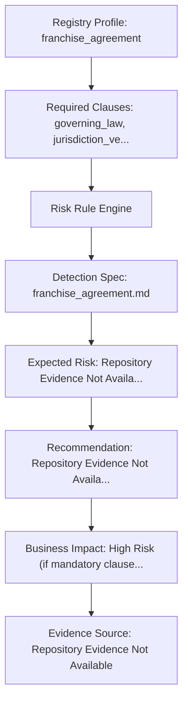

| Traceability Node | Repository Evidence Detail |
| :--- | :--- |
| **Validation ID** | `VAL-012` |
| **Registry Profile ID** | `franchise_agreement` (Franchise Agreement) — Family: `commercial_agreements` |
| **Supported Languages** | `id, fr, nl, en` |
| **Validation Scenario Metadata** | `1 (1 Primary Audit)` |
| **Required Clauses** | `governing_law, jurisdiction_venue, license_grant, ip_ownership, payment_terms, termination, dispute_resolution` |
| **Recommended Clauses** | `royalty_fees, brand_standards, training, territory_protection` |
| **Dangerous Clauses** | `governing_law, jurisdiction_venue, license_grant, ip_ownership, payment_terms, termination, dispute_resolution` |
| **Abusive Clauses** | `royalty_fees, brand_standards, training, territory_protection` |
| **Illegal Clauses** | `Repository Evidence Not Available` |
| **Leonine Clauses** | `Repository Evidence Not Available` |
| **Expected Risk** | **Repository Evidence Not Available** |
| **Expected Recommendation** | Repository Evidence Not Available |
| **Expected Business Impact** | High Risk (if mandatory clauses missing / general risk rule triggered) |
| **Detection Specification** | `docs/lightml/detection_specifications/franchise_agreement.md` |
| **Legal Evidence Source** | `Repository Evidence Not Available` |
| **Engineering Implementation** | `Draft Specification Only (No Active JSON Schema)` |
| **Reviewer Required** | Legal-data and Content Owner (Ilham) / Qualified Legal Reviewer |
| **Repository Status** | **Partial (Pending Legal Review)** |
| **Repository Notes** | Canonical profile in registry_v1.json; detection specification available, pending active JSON schema & legal evidence. |

---

## Registry Profile: `supply_agreement` — Supply Agreement

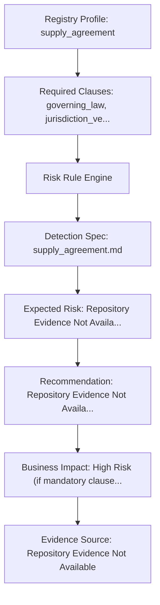

| Traceability Node | Repository Evidence Detail |
| :--- | :--- |
| **Validation ID** | `VAL-013` |
| **Registry Profile ID** | `supply_agreement` (Supply Agreement) — Family: `commercial_agreements` |
| **Supported Languages** | `id, fr, nl, en` |
| **Validation Scenario Metadata** | `1 (1 Primary Audit)` |
| **Required Clauses** | `governing_law, jurisdiction_venue, goods_description, payment_terms, delivery_terms, warranty, termination, dispute_resolution` |
| **Recommended Clauses** | `quality_standards, minimum_volume, lead_time, price_adjustment` |
| **Dangerous Clauses** | `governing_law, jurisdiction_venue, goods_description, payment_terms, delivery_terms, warranty, termination, dispute_resolution` |
| **Abusive Clauses** | `quality_standards, minimum_volume, lead_time, price_adjustment` |
| **Illegal Clauses** | `Repository Evidence Not Available` |
| **Leonine Clauses** | `Repository Evidence Not Available` |
| **Expected Risk** | **Repository Evidence Not Available** |
| **Expected Recommendation** | Repository Evidence Not Available |
| **Expected Business Impact** | High Risk (if mandatory clauses missing / general risk rule triggered) |
| **Detection Specification** | `docs/lightml/detection_specifications/supply_agreement.md` |
| **Legal Evidence Source** | `Repository Evidence Not Available` |
| **Engineering Implementation** | `Draft Specification Only (No Active JSON Schema)` |
| **Reviewer Required** | Legal-data and Content Owner (Ilham) / Qualified Legal Reviewer |
| **Repository Status** | **Partial (Pending Legal Review)** |
| **Repository Notes** | Canonical profile in registry_v1.json; detection specification available, pending active JSON schema & legal evidence. |

---

## Registry Profile: `agency_agreement` — Agency Agreement

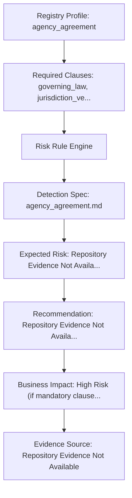

| Traceability Node | Repository Evidence Detail |
| :--- | :--- |
| **Validation ID** | `VAL-014` |
| **Registry Profile ID** | `agency_agreement` (Agency Agreement) — Family: `commercial_agreements` |
| **Supported Languages** | `id, fr, nl, en` |
| **Validation Scenario Metadata** | `1 (1 Primary Audit)` |
| **Required Clauses** | `governing_law, jurisdiction_venue, scope_of_services, compensation, termination, dispute_resolution` |
| **Recommended Clauses** | `commission_structure, territory, authority_limits, reporting` |
| **Dangerous Clauses** | `governing_law, jurisdiction_venue, scope_of_services, compensation, termination, dispute_resolution` |
| **Abusive Clauses** | `commission_structure, territory, authority_limits, reporting` |
| **Illegal Clauses** | `Repository Evidence Not Available` |
| **Leonine Clauses** | `Repository Evidence Not Available` |
| **Expected Risk** | **Repository Evidence Not Available** |
| **Expected Recommendation** | Repository Evidence Not Available |
| **Expected Business Impact** | High Risk (if mandatory clauses missing / general risk rule triggered) |
| **Detection Specification** | `docs/lightml/detection_specifications/agency_agreement.md` |
| **Legal Evidence Source** | `Repository Evidence Not Available` |
| **Engineering Implementation** | `Draft Specification Only (No Active JSON Schema)` |
| **Reviewer Required** | Legal-data and Content Owner (Ilham) / Qualified Legal Reviewer |
| **Repository Status** | **Partial (Pending Legal Review)** |
| **Repository Notes** | Canonical profile in registry_v1.json; detection specification available, pending active JSON schema & legal evidence. |

---

## Registry Profile: `shareholder_agreement` — Shareholder Agreement

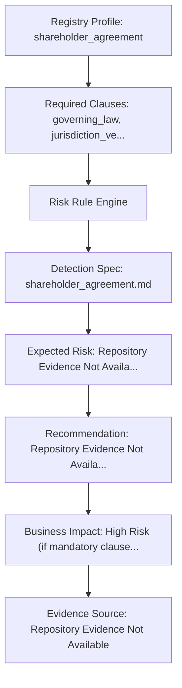

| Traceability Node | Repository Evidence Detail |
| :--- | :--- |
| **Validation ID** | `VAL-015` |
| **Registry Profile ID** | `shareholder_agreement` (Shareholder Agreement) — Family: `corporate_agreements` |
| **Supported Languages** | `id, fr, nl, en` |
| **Validation Scenario Metadata** | `1 (1 Primary Audit)` |
| **Required Clauses** | `governing_law, jurisdiction_venue, capital_contribution, profit_sharing, management_rights, termination, dispute_resolution` |
| **Recommended Clauses** | `drag_along, tag_along, preemption_rights, board_representation` |
| **Dangerous Clauses** | `governing_law, jurisdiction_venue, capital_contribution, profit_sharing, management_rights, termination, dispute_resolution` |
| **Abusive Clauses** | `drag_along, tag_along, preemption_rights, board_representation` |
| **Illegal Clauses** | `Repository Evidence Not Available` |
| **Leonine Clauses** | `Repository Evidence Not Available` |
| **Expected Risk** | **Repository Evidence Not Available** |
| **Expected Recommendation** | Repository Evidence Not Available |
| **Expected Business Impact** | High Risk (if mandatory clauses missing / general risk rule triggered) |
| **Detection Specification** | `docs/lightml/detection_specifications/shareholder_agreement.md` |
| **Legal Evidence Source** | `Repository Evidence Not Available` |
| **Engineering Implementation** | `Draft Specification Only (No Active JSON Schema)` |
| **Reviewer Required** | Legal-data and Content Owner (Ilham) / Qualified Legal Reviewer |
| **Repository Status** | **Partial (Pending Legal Review)** |
| **Repository Notes** | Canonical profile in registry_v1.json; detection specification available, pending active JSON schema & legal evidence. |

---

## Registry Profile: `investment_agreement` — Investment Agreement

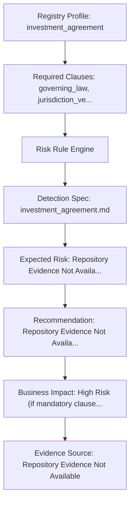

| Traceability Node | Repository Evidence Detail |
| :--- | :--- |
| **Validation ID** | `VAL-016` |
| **Registry Profile ID** | `investment_agreement` (Investment Agreement) — Family: `corporate_agreements` |
| **Supported Languages** | `id, fr, nl, en` |
| **Validation Scenario Metadata** | `1 (1 Primary Audit)` |
| **Required Clauses** | `governing_law, jurisdiction_venue, principal_amount, profit_sharing, termination, dispute_resolution` |
| **Recommended Clauses** | `liquidation_preference, anti_dilution, information_rights, veto_rights` |
| **Dangerous Clauses** | `governing_law, jurisdiction_venue, principal_amount, profit_sharing, termination, dispute_resolution` |
| **Abusive Clauses** | `liquidation_preference, anti_dilution, information_rights, veto_rights` |
| **Illegal Clauses** | `Repository Evidence Not Available` |
| **Leonine Clauses** | `Repository Evidence Not Available` |
| **Expected Risk** | **Repository Evidence Not Available** |
| **Expected Recommendation** | Repository Evidence Not Available |
| **Expected Business Impact** | High Risk (if mandatory clauses missing / general risk rule triggered) |
| **Detection Specification** | `docs/lightml/detection_specifications/investment_agreement.md` |
| **Legal Evidence Source** | `Repository Evidence Not Available` |
| **Engineering Implementation** | `Draft Specification Only (No Active JSON Schema)` |
| **Reviewer Required** | Legal-data and Content Owner (Ilham) / Qualified Legal Reviewer |
| **Repository Status** | **Partial (Pending Legal Review)** |
| **Repository Notes** | Canonical profile in registry_v1.json; detection specification available, pending active JSON schema & legal evidence. |

---

## Registry Profile: `construction_contract` — Construction Contract

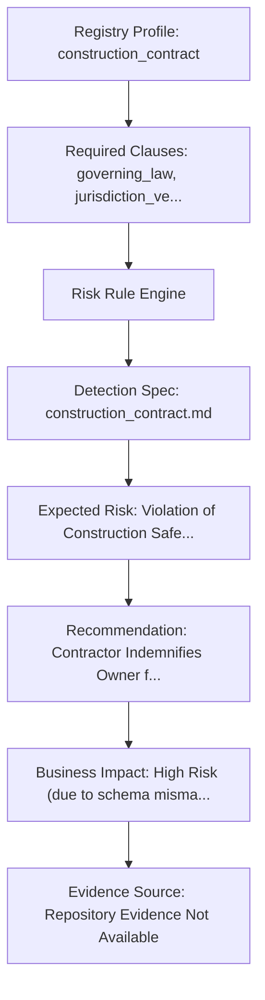

| Traceability Node | Repository Evidence Detail |
| :--- | :--- |
| **Validation ID** | `VAL-017` |
| **Registry Profile ID** | `construction_contract` (Construction Contract) — Family: `property_agreements` |
| **Supported Languages** | `id, en` |
| **Validation Scenario Metadata** | `2 (1 Primary Audit + 1 Schema Sync)` |
| **Required Clauses** | `governing_law, jurisdiction_venue, scope_of_services, payment_terms, delivery_terms, warranty, termination, indemnification, dispute_resolution` |
| **Recommended Clauses** | `insurance, milestone_payments, delay_penalties, defect_liability` |
| **Dangerous Clauses** | `governing_law, jurisdiction_venue, scope_of_services, payment_terms, delivery_terms, warranty, termination, indemnification, dispute_resolution` |
| **Abusive Clauses** | `insurance, milestone_payments, delay_penalties, defect_liability` |
| **Illegal Clauses** | `Uncapped Liquidated Damages for Rain Delays, Mandatory Work Continuation During Non-Payment` |
| **Leonine Clauses** | `Owner Right to Withhold Final Payment Without Inspection Report` |
| **Expected Risk** | **Violation of Construction Safety Statutory Standards (UU 2/2017)** |
| **Expected Recommendation** | Contractor Indemnifies Owner for Owner Structural Design Faults |
| **Expected Business Impact** | High Risk (due to schema mismatch & missing mandatory clauses) |
| **Detection Specification** | `docs/lightml/detection_specifications/construction_contract.md` |
| **Legal Evidence Source** | `Repository Evidence Not Available` |
| **Engineering Implementation** | `Implementation Mismatch (construction_agreement.json vs registry_v1.json)` |
| **Reviewer Required** | Legal-data and Content Owner (Ilham) / Engineering Lead |
| **Repository Status** | **Pending Engineering Sync** |
| **Repository Notes** | Canonical profile in registry_v1.json; active JSON schema mismatch (construction_agreement.json) requires reconciliation. |

---

## Registry Profile: `maintenance_contract` — Maintenance Contract

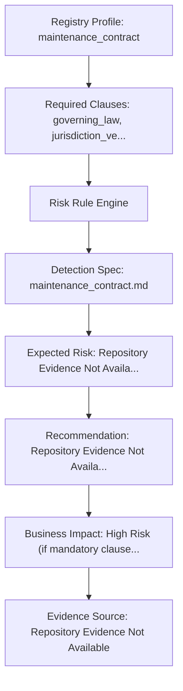

| Traceability Node | Repository Evidence Detail |
| :--- | :--- |
| **Validation ID** | `VAL-018` |
| **Registry Profile ID** | `maintenance_contract` (Maintenance Contract) — Family: `property_agreements` |
| **Supported Languages** | `id, fr, nl, en` |
| **Validation Scenario Metadata** | `1 (1 Primary Audit)` |
| **Required Clauses** | `governing_law, jurisdiction_venue, scope_of_services, payment_terms, termination, limitation_liability, dispute_resolution` |
| **Recommended Clauses** | `response_times, spare_parts, preventive_maintenance, sla` |
| **Dangerous Clauses** | `governing_law, jurisdiction_venue, scope_of_services, payment_terms, termination, limitation_liability, dispute_resolution` |
| **Abusive Clauses** | `response_times, spare_parts, preventive_maintenance, sla` |
| **Illegal Clauses** | `Repository Evidence Not Available` |
| **Leonine Clauses** | `Repository Evidence Not Available` |
| **Expected Risk** | **Repository Evidence Not Available** |
| **Expected Recommendation** | Repository Evidence Not Available |
| **Expected Business Impact** | High Risk (if mandatory clauses missing / general risk rule triggered) |
| **Detection Specification** | `docs/lightml/detection_specifications/maintenance_contract.md` |
| **Legal Evidence Source** | `Repository Evidence Not Available` |
| **Engineering Implementation** | `Draft Specification Only (No Active JSON Schema)` |
| **Reviewer Required** | Legal-data and Content Owner (Ilham) / Qualified Legal Reviewer |
| **Repository Status** | **Partial (Pending Legal Review)** |
| **Repository Notes** | Canonical profile in registry_v1.json; detection specification available, pending active JSON schema & legal evidence. |

---

## Registry Profile: `it_services_contract` — IT Services Contract

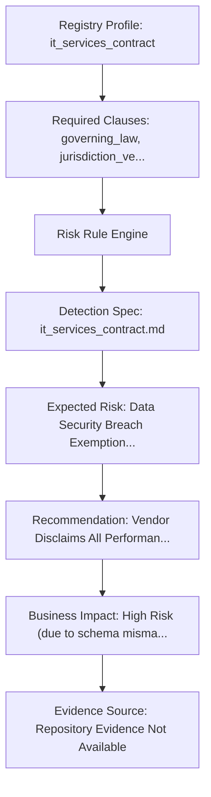

| Traceability Node | Repository Evidence Detail |
| :--- | :--- |
| **Validation ID** | `VAL-019` |
| **Registry Profile ID** | `it_services_contract` (IT Services Contract) — Family: `commercial_agreements` |
| **Supported Languages** | `id, fr, nl, en` |
| **Validation Scenario Metadata** | `2 (1 Primary Audit + 1 Schema Sync)` |
| **Required Clauses** | `governing_law, jurisdiction_venue, scope_of_services, payment_terms, ip_ownership, limitation_liability, warranty_disclaimer, termination, dispute_resolution` |
| **Recommended Clauses** | `disaster_recovery, data_security, uptime_guarantee, backup_frequency` |
| **Dangerous Clauses** | `governing_law, jurisdiction_venue, scope_of_services, payment_terms, ip_ownership, limitation_liability, warranty_disclaimer, termination, dispute_resolution` |
| **Abusive Clauses** | `disaster_recovery, data_security, uptime_guarantee, backup_frequency` |
| **Illegal Clauses** | `Uncapped SLA Liquidated Damages, Unrestricted Vendor Remote Access Without Audit Logging` |
| **Leonine Clauses** | `Vendor Claiming Ownership of Client Proprietary Data & System Backups` |
| **Expected Risk** | **Data Security Breach Exemption Violating PDP Law (UU 27/2022)** |
| **Expected Recommendation** | Vendor Disclaims All Performance Guarantees While Retaining Full Monthly Maintenance Fees |
| **Expected Business Impact** | High Risk (due to schema mismatch & missing mandatory clauses) |
| **Detection Specification** | `docs/lightml/detection_specifications/it_services_contract.md` |
| **Legal Evidence Source** | `Repository Evidence Not Available` |
| **Engineering Implementation** | `Implementation Mismatch (it_service_agreement.json vs registry_v1.json)` |
| **Reviewer Required** | Legal-data and Content Owner (Ilham) / Engineering Lead |
| **Repository Status** | **Pending Engineering Sync** |
| **Repository Notes** | Canonical profile in registry_v1.json; active JSON schema mismatch (it_service_agreement.json) requires reconciliation. |

---

## Registry Profile: `data_processing_agreement` — Data Processing Agreement

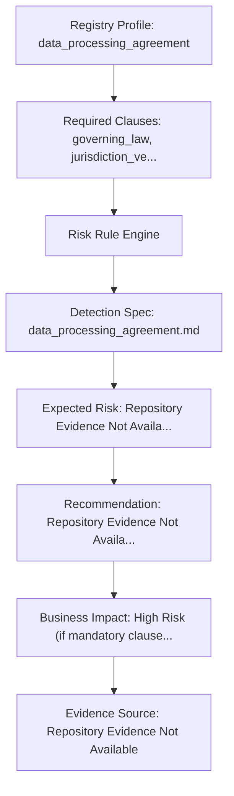

| Traceability Node | Repository Evidence Detail |
| :--- | :--- |
| **Validation ID** | `VAL-020` |
| **Registry Profile ID** | `data_processing_agreement` (Data Processing Agreement) — Family: `commercial_agreements` |
| **Supported Languages** | `fr, nl, en` |
| **Validation Scenario Metadata** | `1 (1 Primary Audit)` |
| **Required Clauses** | `governing_law, jurisdiction_venue, confidentiality, termination, dispute_resolution` |
| **Recommended Clauses** | `sub_processor_approval, breach_notification, audit_rights, data_deletion` |
| **Dangerous Clauses** | `governing_law, jurisdiction_venue, confidentiality, termination, dispute_resolution` |
| **Abusive Clauses** | `sub_processor_approval, breach_notification, audit_rights, data_deletion` |
| **Illegal Clauses** | `Repository Evidence Not Available` |
| **Leonine Clauses** | `Repository Evidence Not Available` |
| **Expected Risk** | **Repository Evidence Not Available** |
| **Expected Recommendation** | Repository Evidence Not Available |
| **Expected Business Impact** | High Risk (if mandatory clauses missing / general risk rule triggered) |
| **Detection Specification** | `docs/lightml/detection_specifications/data_processing_agreement.md` |
| **Legal Evidence Source** | `Repository Evidence Not Available` |
| **Engineering Implementation** | `Draft Specification Only (No Active JSON Schema)` |
| **Reviewer Required** | Legal-data and Content Owner (Ilham) / Qualified Legal Reviewer |
| **Repository Status** | **Partial (Pending Legal Review)** |
| **Repository Notes** | Canonical profile in registry_v1.json; detection specification available, pending active JSON schema & legal evidence. |

---

## Registry Profile: `intellectual_property_assignment` — Intellectual Property Assignment

```mermaid
graph TD
    A["Registry Profile: intellectual_property_assignment"] --> B["Required Clauses: governing_law, jurisdiction_ve..."]
    B --> C["Risk Rule Engine"]
    C --> D["Detection Spec: intellectual_property_assignment.md"]
    D --> E["Expected Risk: Repository Evidence Not Availa..."]
    E --> F["Recommendation: Repository Evidence Not Availa..."]
    F --> G["Business Impact: High Risk (if mandatory clause..."]
    G --> H["Evidence Source: Repository Evidence Not Available"]
```

| Traceability Node | Repository Evidence Detail |
| :--- | :--- |
| **Validation ID** | `VAL-021` |
| **Registry Profile ID** | `intellectual_property_assignment` (Intellectual Property Assignment) — Family: `commercial_agreements` |
| **Supported Languages** | `id, fr, nl, en` |
| **Validation Scenario Metadata** | `1 (1 Primary Audit)` |
| **Required Clauses** | `governing_law, jurisdiction_venue, ip_ownership, compensation, warranty, dispute_resolution` |
| **Recommended Clauses** | `further_assurances, moral_rights_waiver, power_of_attorney` |
| **Dangerous Clauses** | `governing_law, jurisdiction_venue, ip_ownership, compensation, warranty, dispute_resolution` |
| **Abusive Clauses** | `further_assurances, moral_rights_waiver, power_of_attorney` |
| **Illegal Clauses** | `Repository Evidence Not Available` |
| **Leonine Clauses** | `Repository Evidence Not Available` |
| **Expected Risk** | **Repository Evidence Not Available** |
| **Expected Recommendation** | Repository Evidence Not Available |
| **Expected Business Impact** | High Risk (if mandatory clauses missing / general risk rule triggered) |
| **Detection Specification** | `docs/lightml/detection_specifications/intellectual_property_assignment.md` |
| **Legal Evidence Source** | `Repository Evidence Not Available` |
| **Engineering Implementation** | `Draft Specification Only (No Active JSON Schema)` |
| **Reviewer Required** | Legal-data and Content Owner (Ilham) / Qualified Legal Reviewer |
| **Repository Status** | **Partial (Pending Legal Review)** |
| **Repository Notes** | Canonical profile in registry_v1.json; detection specification available, pending active JSON schema & legal evidence. |

---

## Registry Profile: `licensing_agreement` — Licensing Agreement

```mermaid
graph TD
    A["Registry Profile: licensing_agreement"] --> B["Required Clauses: governing_law, jurisdiction_ve..."]
    B --> C["Risk Rule Engine"]
    C --> D["Detection Spec: licensing_agreement.md"]
    D --> E["Expected Risk: Repository Evidence Not Availa..."]
    E --> F["Recommendation: Repository Evidence Not Availa..."]
    F --> G["Business Impact: High Risk (if mandatory clause..."]
    G --> H["Evidence Source: Repository Evidence Not Available"]
```

| Traceability Node | Repository Evidence Detail |
| :--- | :--- |
| **Validation ID** | `VAL-022` |
| **Registry Profile ID** | `licensing_agreement` (Licensing Agreement) — Family: `commercial_agreements` |
| **Supported Languages** | `id, fr, nl, en` |
| **Validation Scenario Metadata** | `1 (1 Primary Audit)` |
| **Required Clauses** | `governing_law, jurisdiction_venue, license_grant, ip_ownership, payment_terms, termination, dispute_resolution` |
| **Recommended Clauses** | `sublicensing_rights, royalty_audit, territory, grant_back` |
| **Dangerous Clauses** | `governing_law, jurisdiction_venue, license_grant, ip_ownership, payment_terms, termination, dispute_resolution` |
| **Abusive Clauses** | `sublicensing_rights, royalty_audit, territory, grant_back` |
| **Illegal Clauses** | `Repository Evidence Not Available` |
| **Leonine Clauses** | `Repository Evidence Not Available` |
| **Expected Risk** | **Repository Evidence Not Available** |
| **Expected Recommendation** | Repository Evidence Not Available |
| **Expected Business Impact** | High Risk (if mandatory clauses missing / general risk rule triggered) |
| **Detection Specification** | `docs/lightml/detection_specifications/licensing_agreement.md` |
| **Legal Evidence Source** | `Repository Evidence Not Available` |
| **Engineering Implementation** | `Draft Specification Only (No Active JSON Schema)` |
| **Reviewer Required** | Legal-data and Content Owner (Ilham) / Qualified Legal Reviewer |
| **Repository Status** | **Partial (Pending Legal Review)** |
| **Repository Notes** | Canonical profile in registry_v1.json; detection specification available, pending active JSON schema & legal evidence. |

---

## Registry Profile: `joint_venture_agreement` — Joint Venture Agreement

```mermaid
graph TD
    A["Registry Profile: joint_venture_agreement"] --> B["Required Clauses: governing_law, jurisdiction_ve..."]
    B --> C["Risk Rule Engine"]
    C --> D["Detection Spec: joint_venture_agreement.md"]
    D --> E["Expected Risk: Repository Evidence Not Availa..."]
    E --> F["Recommendation: Repository Evidence Not Availa..."]
    F --> G["Business Impact: High Risk (if mandatory clause..."]
    G --> H["Evidence Source: Repository Evidence Not Available"]
```

| Traceability Node | Repository Evidence Detail |
| :--- | :--- |
| **Validation ID** | `VAL-023` |
| **Registry Profile ID** | `joint_venture_agreement` (Joint Venture Agreement) — Family: `corporate_agreements` |
| **Supported Languages** | `id, en` |
| **Validation Scenario Metadata** | `1 (1 Primary Audit)` |
| **Required Clauses** | `governing_law, jurisdiction_venue, capital_contribution, profit_sharing, management_rights, termination, dispute_resolution` |
| **Recommended Clauses** | `governance_structure, deadlock_resolution, funding_calls, non_compete` |
| **Dangerous Clauses** | `governing_law, jurisdiction_venue, capital_contribution, profit_sharing, management_rights, termination, dispute_resolution` |
| **Abusive Clauses** | `governance_structure, deadlock_resolution, funding_calls, non_compete` |
| **Illegal Clauses** | `Repository Evidence Not Available` |
| **Leonine Clauses** | `Repository Evidence Not Available` |
| **Expected Risk** | **Repository Evidence Not Available** |
| **Expected Recommendation** | Repository Evidence Not Available |
| **Expected Business Impact** | High Risk (if mandatory clauses missing / general risk rule triggered) |
| **Detection Specification** | `docs/lightml/detection_specifications/joint_venture_agreement.md` |
| **Legal Evidence Source** | `Repository Evidence Not Available` |
| **Engineering Implementation** | `Draft Specification Only (No Active JSON Schema)` |
| **Reviewer Required** | Legal-data and Content Owner (Ilham) / Qualified Legal Reviewer |
| **Repository Status** | **Partial (Pending Legal Review)** |
| **Repository Notes** | Canonical profile in registry_v1.json; detection specification available, pending active JSON schema & legal evidence. |

---

## Registry Profile: `memorandum_of_understanding` — Memorandum of Understanding

```mermaid
graph TD
    A["Registry Profile: memorandum_of_understanding"] --> B["Required Clauses: governing_law, jurisdiction_ve..."]
    B --> C["Risk Rule Engine"]
    C --> D["Detection Spec: memorandum_of_understanding.md"]
    D --> E["Expected Risk: Repository Evidence Not Availa..."]
    E --> F["Recommendation: Repository Evidence Not Availa..."]
    F --> G["Business Impact: High Risk (if mandatory clause..."]
    G --> H["Evidence Source: Repository Evidence Not Available"]
```

| Traceability Node | Repository Evidence Detail |
| :--- | :--- |
| **Validation ID** | `VAL-024` |
| **Registry Profile ID** | `memorandum_of_understanding` (Memorandum of Understanding) — Family: `baseline_agreements` |
| **Supported Languages** | `id, fr, nl, en` |
| **Validation Scenario Metadata** | `1 (1 Primary Audit)` |
| **Required Clauses** | `governing_law, jurisdiction_venue, termination, dispute_resolution` |
| **Recommended Clauses** | `exclusivity_period, non_binding_intent, cost_sharing` |
| **Dangerous Clauses** | `governing_law, jurisdiction_venue, termination, dispute_resolution` |
| **Abusive Clauses** | `exclusivity_period, non_binding_intent, cost_sharing` |
| **Illegal Clauses** | `Repository Evidence Not Available` |
| **Leonine Clauses** | `Repository Evidence Not Available` |
| **Expected Risk** | **Repository Evidence Not Available** |
| **Expected Recommendation** | Repository Evidence Not Available |
| **Expected Business Impact** | High Risk (if mandatory clauses missing / general risk rule triggered) |
| **Detection Specification** | `docs/lightml/detection_specifications/memorandum_of_understanding.md` |
| **Legal Evidence Source** | `Repository Evidence Not Available` |
| **Engineering Implementation** | `Draft Specification Only (No Active JSON Schema)` |
| **Reviewer Required** | Legal-data and Content Owner (Ilham) / Qualified Legal Reviewer |
| **Repository Status** | **Partial (Pending Legal Review)** |
| **Repository Notes** | Canonical profile in registry_v1.json; detection specification available, pending active JSON schema & legal evidence. |

---

## Registry Profile: `subcontract_agreement` — Subcontract Agreement

```mermaid
graph TD
    A["Registry Profile: subcontract_agreement"] --> B["Required Clauses: governing_law, jurisdiction_ve..."]
    B --> C["Risk Rule Engine"]
    C --> D["Detection Spec: subcontract_agreement.md"]
    D --> E["Expected Risk: Repository Evidence Not Availa..."]
    E --> F["Recommendation: Repository Evidence Not Availa..."]
    F --> G["Business Impact: High Risk (if mandatory clause..."]
    G --> H["Evidence Source: Repository Evidence Not Available"]
```

| Traceability Node | Repository Evidence Detail |
| :--- | :--- |
| **Validation ID** | `VAL-025` |
| **Registry Profile ID** | `subcontract_agreement` (Subcontract Agreement) — Family: `commercial_agreements` |
| **Supported Languages** | `id, en` |
| **Validation Scenario Metadata** | `1 (1 Primary Audit)` |
| **Required Clauses** | `governing_law, jurisdiction_venue, scope_of_services, payment_terms, termination, indemnification, dispute_resolution` |
| **Recommended Clauses** | `flow_down_provisions, prime_contract_alignment, payment_upon_client_pay` |
| **Dangerous Clauses** | `governing_law, jurisdiction_venue, scope_of_services, payment_terms, termination, indemnification, dispute_resolution` |
| **Abusive Clauses** | `flow_down_provisions, prime_contract_alignment, payment_upon_client_pay` |
| **Illegal Clauses** | `Repository Evidence Not Available` |
| **Leonine Clauses** | `Repository Evidence Not Available` |
| **Expected Risk** | **Repository Evidence Not Available** |
| **Expected Recommendation** | Repository Evidence Not Available |
| **Expected Business Impact** | High Risk (if mandatory clauses missing / general risk rule triggered) |
| **Detection Specification** | `docs/lightml/detection_specifications/subcontract_agreement.md` |
| **Legal Evidence Source** | `Repository Evidence Not Available` |
| **Engineering Implementation** | `Draft Specification Only (No Active JSON Schema)` |
| **Reviewer Required** | Legal-data and Content Owner (Ilham) / Qualified Legal Reviewer |
| **Repository Status** | **Partial (Pending Legal Review)** |
| **Repository Notes** | Canonical profile in registry_v1.json; detection specification available, pending active JSON schema & legal evidence. |

---

## Registry Profile: `grant_agreement` — Grant Agreement

```mermaid
graph TD
    A["Registry Profile: grant_agreement"] --> B["Required Clauses: governing_law, jurisdiction_ve..."]
    B --> C["Risk Rule Engine"]
    C --> D["Detection Spec: grant_agreement.md"]
    D --> E["Expected Risk: Repository Evidence Not Availa..."]
    E --> F["Recommendation: Repository Evidence Not Availa..."]
    F --> G["Business Impact: High Risk (if mandatory clause..."]
    G --> H["Evidence Source: Repository Evidence Not Available"]
```

| Traceability Node | Repository Evidence Detail |
| :--- | :--- |
| **Validation ID** | `VAL-026` |
| **Registry Profile ID** | `grant_agreement` (Grant Agreement) — Family: `corporate_agreements` |
| **Supported Languages** | `id, fr, en` |
| **Validation Scenario Metadata** | `1 (1 Primary Audit)` |
| **Required Clauses** | `governing_law, jurisdiction_venue, principal_amount, termination, dispute_resolution` |
| **Recommended Clauses** | `reporting_milestones, fund_use_restrictions, audit_rights, clawback` |
| **Dangerous Clauses** | `governing_law, jurisdiction_venue, principal_amount, termination, dispute_resolution` |
| **Abusive Clauses** | `reporting_milestones, fund_use_restrictions, audit_rights, clawback` |
| **Illegal Clauses** | `Repository Evidence Not Available` |
| **Leonine Clauses** | `Repository Evidence Not Available` |
| **Expected Risk** | **Repository Evidence Not Available** |
| **Expected Recommendation** | Repository Evidence Not Available |
| **Expected Business Impact** | High Risk (if mandatory clauses missing / general risk rule triggered) |
| **Detection Specification** | `docs/lightml/detection_specifications/grant_agreement.md` |
| **Legal Evidence Source** | `Repository Evidence Not Available` |
| **Engineering Implementation** | `Draft Specification Only (No Active JSON Schema)` |
| **Reviewer Required** | Legal-data and Content Owner (Ilham) / Qualified Legal Reviewer |
| **Repository Status** | **Partial (Pending Legal Review)** |
| **Repository Notes** | Canonical profile in registry_v1.json; detection specification available, pending active JSON schema & legal evidence. |

---

## Registry Profile: `settlement_agreement` — Settlement Agreement

```mermaid
graph TD
    A["Registry Profile: settlement_agreement"] --> B["Required Clauses: governing_law, jurisdiction_ve..."]
    B --> C["Risk Rule Engine"]
    C --> D["Detection Spec: settlement_agreement.md"]
    D --> E["Expected Risk: Repository Evidence Not Availa..."]
    E --> F["Recommendation: Repository Evidence Not Availa..."]
    F --> G["Business Impact: High Risk (if mandatory clause..."]
    G --> H["Evidence Source: Repository Evidence Not Available"]
```

| Traceability Node | Repository Evidence Detail |
| :--- | :--- |
| **Validation ID** | `VAL-027` |
| **Registry Profile ID** | `settlement_agreement` (Settlement Agreement) — Family: `corporate_agreements` |
| **Supported Languages** | `id, fr, nl, en` |
| **Validation Scenario Metadata** | `1 (1 Primary Audit)` |
| **Required Clauses** | `governing_law, jurisdiction_venue, dispute_resolution, termination, entire_agreement` |
| **Recommended Clauses** | `mutual_release, confidentiality, non_disparagement, no_admission` |
| **Dangerous Clauses** | `governing_law, jurisdiction_venue, dispute_resolution, termination, entire_agreement` |
| **Abusive Clauses** | `mutual_release, confidentiality, non_disparagement, no_admission` |
| **Illegal Clauses** | `Repository Evidence Not Available` |
| **Leonine Clauses** | `Repository Evidence Not Available` |
| **Expected Risk** | **Repository Evidence Not Available** |
| **Expected Recommendation** | Repository Evidence Not Available |
| **Expected Business Impact** | High Risk (if mandatory clauses missing / general risk rule triggered) |
| **Detection Specification** | `docs/lightml/detection_specifications/settlement_agreement.md` |
| **Legal Evidence Source** | `Repository Evidence Not Available` |
| **Engineering Implementation** | `Draft Specification Only (No Active JSON Schema)` |
| **Reviewer Required** | Legal-data and Content Owner (Ilham) / Qualified Legal Reviewer |
| **Repository Status** | **Partial (Pending Legal Review)** |
| **Repository Notes** | Canonical profile in registry_v1.json; detection specification available, pending active JSON schema & legal evidence. |

---

## Registry Profile: `sponsorship_agreement` — Sponsorship Agreement

```mermaid
graph TD
    A["Registry Profile: sponsorship_agreement"] --> B["Required Clauses: governing_law, jurisdiction_ve..."]
    B --> C["Risk Rule Engine"]
    C --> D["Detection Spec: sponsorship_agreement.md"]
    D --> E["Expected Risk: Repository Evidence Not Availa..."]
    E --> F["Recommendation: Repository Evidence Not Availa..."]
    F --> G["Business Impact: High Risk (if mandatory clause..."]
    G --> H["Evidence Source: Repository Evidence Not Available"]
```

| Traceability Node | Repository Evidence Detail |
| :--- | :--- |
| **Validation ID** | `VAL-028` |
| **Registry Profile ID** | `sponsorship_agreement` (Sponsorship Agreement) — Family: `commercial_agreements` |
| **Supported Languages** | `id, fr, nl, en` |
| **Validation Scenario Metadata** | `1 (1 Primary Audit)` |
| **Required Clauses** | `governing_law, jurisdiction_venue, payment_terms, ip_ownership, termination, dispute_resolution` |
| **Recommended Clauses** | `logo_placement, exclusivity_category, complimentary_tickets, cancellation` |
| **Dangerous Clauses** | `governing_law, jurisdiction_venue, payment_terms, ip_ownership, termination, dispute_resolution` |
| **Abusive Clauses** | `logo_placement, exclusivity_category, complimentary_tickets, cancellation` |
| **Illegal Clauses** | `Repository Evidence Not Available` |
| **Leonine Clauses** | `Repository Evidence Not Available` |
| **Expected Risk** | **Repository Evidence Not Available** |
| **Expected Recommendation** | Repository Evidence Not Available |
| **Expected Business Impact** | High Risk (if mandatory clauses missing / general risk rule triggered) |
| **Detection Specification** | `docs/lightml/detection_specifications/sponsorship_agreement.md` |
| **Legal Evidence Source** | `Repository Evidence Not Available` |
| **Engineering Implementation** | `Draft Specification Only (No Active JSON Schema)` |
| **Reviewer Required** | Legal-data and Content Owner (Ilham) / Qualified Legal Reviewer |
| **Repository Status** | **Partial (Pending Legal Review)** |
| **Repository Notes** | Canonical profile in registry_v1.json; detection specification available, pending active JSON schema & legal evidence. |

---

## Registry Profile: `event_contract` — Event Contract

```mermaid
graph TD
    A["Registry Profile: event_contract"] --> B["Required Clauses: governing_law, jurisdiction_ve..."]
    B --> C["Risk Rule Engine"]
    C --> D["Detection Spec: event_contract.md"]
    D --> E["Expected Risk: Repository Evidence Not Availa..."]
    E --> F["Recommendation: Repository Evidence Not Availa..."]
    F --> G["Business Impact: High Risk (if mandatory clause..."]
    G --> H["Evidence Source: Repository Evidence Not Available"]
```

| Traceability Node | Repository Evidence Detail |
| :--- | :--- |
| **Validation ID** | `VAL-029` |
| **Registry Profile ID** | `event_contract` (Event Contract) — Family: `commercial_agreements` |
| **Supported Languages** | `id, en` |
| **Validation Scenario Metadata** | `1 (1 Primary Audit)` |
| **Required Clauses** | `governing_law, jurisdiction_venue, scope_of_services, payment_terms, force_majeure, termination, dispute_resolution` |
| **Recommended Clauses** | `cancellation_policy, security_deposit, force_majeure, noise_curfew` |
| **Dangerous Clauses** | `governing_law, jurisdiction_venue, scope_of_services, payment_terms, force_majeure, termination, dispute_resolution` |
| **Abusive Clauses** | `cancellation_policy, security_deposit, force_majeure, noise_curfew` |
| **Illegal Clauses** | `Repository Evidence Not Available` |
| **Leonine Clauses** | `Repository Evidence Not Available` |
| **Expected Risk** | **Repository Evidence Not Available** |
| **Expected Recommendation** | Repository Evidence Not Available |
| **Expected Business Impact** | High Risk (if mandatory clauses missing / general risk rule triggered) |
| **Detection Specification** | `docs/lightml/detection_specifications/event_contract.md` |
| **Legal Evidence Source** | `Repository Evidence Not Available` |
| **Engineering Implementation** | `Draft Specification Only (No Active JSON Schema)` |
| **Reviewer Required** | Legal-data and Content Owner (Ilham) / Qualified Legal Reviewer |
| **Repository Status** | **Partial (Pending Legal Review)** |
| **Repository Notes** | Canonical profile in registry_v1.json; detection specification available, pending active JSON schema & legal evidence. |

---

## Registry Profile: `property_management_agreement` — Property Management Agreement

```mermaid
graph TD
    A["Registry Profile: property_management_agreement"] --> B["Required Clauses: governing_law, jurisdiction_ve..."]
    B --> C["Risk Rule Engine"]
    C --> D["Detection Spec: property_management_agreement.md"]
    D --> E["Expected Risk: Repository Evidence Not Availa..."]
    E --> F["Recommendation: Repository Evidence Not Availa..."]
    F --> G["Business Impact: High Risk (if mandatory clause..."]
    G --> H["Evidence Source: Repository Evidence Not Available"]
```

| Traceability Node | Repository Evidence Detail |
| :--- | :--- |
| **Validation ID** | `VAL-030` |
| **Registry Profile ID** | `property_management_agreement` (Property Management Agreement) — Family: `property_agreements` |
| **Supported Languages** | `id, en` |
| **Validation Scenario Metadata** | `1 (1 Primary Audit)` |
| **Required Clauses** | `governing_law, jurisdiction_venue, scope_of_services, compensation, termination, indemnification, dispute_resolution` |
| **Recommended Clauses** | `fee_percentage, spending_authority_limits, reporting_frequency` |
| **Dangerous Clauses** | `governing_law, jurisdiction_venue, scope_of_services, compensation, termination, indemnification, dispute_resolution` |
| **Abusive Clauses** | `fee_percentage, spending_authority_limits, reporting_frequency` |
| **Illegal Clauses** | `Repository Evidence Not Available` |
| **Leonine Clauses** | `Repository Evidence Not Available` |
| **Expected Risk** | **Repository Evidence Not Available** |
| **Expected Recommendation** | Repository Evidence Not Available |
| **Expected Business Impact** | High Risk (if mandatory clauses missing / general risk rule triggered) |
| **Detection Specification** | `docs/lightml/detection_specifications/property_management_agreement.md` |
| **Legal Evidence Source** | `Repository Evidence Not Available` |
| **Engineering Implementation** | `Draft Specification Only (No Active JSON Schema)` |
| **Reviewer Required** | Legal-data and Content Owner (Ilham) / Qualified Legal Reviewer |
| **Repository Status** | **Partial (Pending Legal Review)** |
| **Repository Notes** | Canonical profile in registry_v1.json; detection specification available, pending active JSON schema & legal evidence. |

---

## Registry Profile: `insurance_contract` — Insurance Contract / Policy

```mermaid
graph TD
    A["Registry Profile: insurance_contract"] --> B["Required Clauses: governing_law, jurisdiction_ve..."]
    B --> C["Risk Rule Engine"]
    C --> D["Detection Spec: insurance_contract.md"]
    D --> E["Expected Risk: Unenforceable Insurance Exclus..."]
    E --> F["Recommendation: Insurer Forfeits Premiums whil..."]
    F --> G["Business Impact: High Risk (due to schema misma..."]
    G --> H["Evidence Source: Repository Evidence Not Available"]
```

| Traceability Node | Repository Evidence Detail |
| :--- | :--- |
| **Validation ID** | `VAL-031` |
| **Registry Profile ID** | `insurance_contract` (Insurance Contract / Policy) — Family: `corporate_agreements` |
| **Supported Languages** | `id, fr, nl, en` |
| **Validation Scenario Metadata** | `2 (1 Primary Audit + 1 Schema Sync)` |
| **Required Clauses** | `governing_law, jurisdiction_venue, insurance, termination, dispute_resolution` |
| **Recommended Clauses** | `deductible_terms, notice_of_loss_period, subrogation_rights` |
| **Dangerous Clauses** | `governing_law, jurisdiction_venue, insurance, termination, dispute_resolution` |
| **Abusive Clauses** | `deductible_terms, notice_of_loss_period, subrogation_rights` |
| **Illegal Clauses** | `Immediate Exclusions Without Notice, Short Notice Period for Claim Filing` |
| **Leonine Clauses** | `Insurer Right to Alter Policy Coverage Mid-Term Without Premium Reduction` |
| **Expected Risk** | **Unenforceable Insurance Exclusion Contrary to Insurance Law (UU 40/2014)** |
| **Expected Recommendation** | Insurer Forfeits Premiums while Denying Coverage for Minor Technicalities |
| **Expected Business Impact** | High Risk (due to schema mismatch & missing mandatory clauses) |
| **Detection Specification** | `docs/lightml/detection_specifications/insurance_contract.md` |
| **Legal Evidence Source** | `Repository Evidence Not Available` |
| **Engineering Implementation** | `Implementation Mismatch (insurance_agreement.json vs registry_v1.json)` |
| **Reviewer Required** | Legal-data and Content Owner (Ilham) / Engineering Lead |
| **Repository Status** | **Pending Engineering Sync** |
| **Repository Notes** | Canonical profile in registry_v1.json; active JSON schema mismatch (insurance_agreement.json) requires reconciliation. |

---

## Registry Profile: `escrow_agreement` — Escrow Agreement

```mermaid
graph TD
    A["Registry Profile: escrow_agreement"] --> B["Required Clauses: governing_law, jurisdiction_ve..."]
    B --> C["Risk Rule Engine"]
    C --> D["Detection Spec: escrow_agreement.md"]
    D --> E["Expected Risk: Repository Evidence Not Availa..."]
    E --> F["Recommendation: Repository Evidence Not Availa..."]
    F --> G["Business Impact: High Risk (if mandatory clause..."]
    G --> H["Evidence Source: Repository Evidence Not Available"]
```

| Traceability Node | Repository Evidence Detail |
| :--- | :--- |
| **Validation ID** | `VAL-032` |
| **Registry Profile ID** | `escrow_agreement` (Escrow Agreement) — Family: `corporate_agreements` |
| **Supported Languages** | `id, en` |
| **Validation Scenario Metadata** | `1 (1 Primary Audit)` |
| **Required Clauses** | `governing_law, jurisdiction_venue, principal_amount, termination, dispute_resolution` |
| **Recommended Clauses** | `release_conditions, escrow_agent_fees, dispute_holdoutoverback` |
| **Dangerous Clauses** | `governing_law, jurisdiction_venue, principal_amount, termination, dispute_resolution` |
| **Abusive Clauses** | `release_conditions, escrow_agent_fees, dispute_holdoutoverback` |
| **Illegal Clauses** | `Repository Evidence Not Available` |
| **Leonine Clauses** | `Repository Evidence Not Available` |
| **Expected Risk** | **Repository Evidence Not Available** |
| **Expected Recommendation** | Repository Evidence Not Available |
| **Expected Business Impact** | High Risk (if mandatory clauses missing / general risk rule triggered) |
| **Detection Specification** | `docs/lightml/detection_specifications/escrow_agreement.md` |
| **Legal Evidence Source** | `Repository Evidence Not Available` |
| **Engineering Implementation** | `Draft Specification Only (No Active JSON Schema)` |
| **Reviewer Required** | Legal-data and Content Owner (Ilham) / Qualified Legal Reviewer |
| **Repository Status** | **Partial (Pending Legal Review)** |
| **Repository Notes** | Canonical profile in registry_v1.json; detection specification available, pending active JSON schema & legal evidence. |

---

## Registry Profile: `outsourcing_agreement` — Outsourcing Agreement

```mermaid
graph TD
    A["Registry Profile: outsourcing_agreement"] --> B["Required Clauses: governing_law, jurisdiction_ve..."]
    B --> C["Risk Rule Engine"]
    C --> D["Detection Spec: outsourcing_agreement.md"]
    D --> E["Expected Risk: Repository Evidence Not Availa..."]
    E --> F["Recommendation: Repository Evidence Not Availa..."]
    F --> G["Business Impact: High Risk (if mandatory clause..."]
    G --> H["Evidence Source: Repository Evidence Not Available"]
```

| Traceability Node | Repository Evidence Detail |
| :--- | :--- |
| **Validation ID** | `VAL-033` |
| **Registry Profile ID** | `outsourcing_agreement` (Outsourcing Agreement) — Family: `commercial_agreements` |
| **Supported Languages** | `id, en` |
| **Validation Scenario Metadata** | `1 (1 Primary Audit)` |
| **Required Clauses** | `governing_law, jurisdiction_venue, scope_of_services, payment_terms, confidentiality, termination, dispute_resolution` |
| **Recommended Clauses** | `transition_assistance, benchmark_pricing, data_portability, audit` |
| **Dangerous Clauses** | `governing_law, jurisdiction_venue, scope_of_services, payment_terms, confidentiality, termination, dispute_resolution` |
| **Abusive Clauses** | `transition_assistance, benchmark_pricing, data_portability, audit` |
| **Illegal Clauses** | `Repository Evidence Not Available` |
| **Leonine Clauses** | `Repository Evidence Not Available` |
| **Expected Risk** | **Repository Evidence Not Available** |
| **Expected Recommendation** | Repository Evidence Not Available |
| **Expected Business Impact** | High Risk (if mandatory clauses missing / general risk rule triggered) |
| **Detection Specification** | `docs/lightml/detection_specifications/outsourcing_agreement.md` |
| **Legal Evidence Source** | `Repository Evidence Not Available` |
| **Engineering Implementation** | `Draft Specification Only (No Active JSON Schema)` |
| **Reviewer Required** | Legal-data and Content Owner (Ilham) / Qualified Legal Reviewer |
| **Repository Status** | **Partial (Pending Legal Review)** |
| **Repository Notes** | Canonical profile in registry_v1.json; detection specification available, pending active JSON schema & legal evidence. |

---

## Registry Profile: `employment_termination_agreement` — Employment Termination Agreement

```mermaid
graph TD
    A["Registry Profile: employment_termination_agreement"] --> B["Required Clauses: governing_law, jurisdiction_ve..."]
    B --> C["Risk Rule Engine"]
    C --> D["Detection Spec: employment_termination_agreement.md"]
    D --> E["Expected Risk: Repository Evidence Not Availa..."]
    E --> F["Recommendation: Repository Evidence Not Availa..."]
    F --> G["Business Impact: High Risk (if mandatory clause..."]
    G --> H["Evidence Source: Repository Evidence Not Available"]
```

| Traceability Node | Repository Evidence Detail |
| :--- | :--- |
| **Validation ID** | `VAL-034` |
| **Registry Profile ID** | `employment_termination_agreement` (Employment Termination Agreement) — Family: `employment_agreements` |
| **Supported Languages** | `id, en` |
| **Validation Scenario Metadata** | `1 (1 Primary Audit)` |
| **Required Clauses** | `governing_law, jurisdiction_venue, compensation, termination, dispute_resolution, entire_agreement` |
| **Recommended Clauses** | `severance_schedule, waiver_of_claims, non_compete_duration` |
| **Dangerous Clauses** | `governing_law, jurisdiction_venue, compensation, termination, dispute_resolution, entire_agreement` |
| **Abusive Clauses** | `severance_schedule, waiver_of_claims, non_compete_duration` |
| **Illegal Clauses** | `Repository Evidence Not Available` |
| **Leonine Clauses** | `Repository Evidence Not Available` |
| **Expected Risk** | **Repository Evidence Not Available** |
| **Expected Recommendation** | Repository Evidence Not Available |
| **Expected Business Impact** | High Risk (if mandatory clauses missing / general risk rule triggered) |
| **Detection Specification** | `docs/lightml/detection_specifications/employment_termination_agreement.md` |
| **Legal Evidence Source** | `Repository Evidence Not Available` |
| **Engineering Implementation** | `Draft Specification Only (No Active JSON Schema)` |
| **Reviewer Required** | Legal-data and Content Owner (Ilham) / Qualified Legal Reviewer |
| **Repository Status** | **Partial (Pending Legal Review)** |
| **Repository Notes** | Canonical profile in registry_v1.json; detection specification available, pending active JSON schema & legal evidence. |

---

## Registry Profile: `sales_representative_agreement` — Sales Representative Agreement

```mermaid
graph TD
    A["Registry Profile: sales_representative_agreement"] --> B["Required Clauses: governing_law, jurisdiction_ve..."]
    B --> C["Risk Rule Engine"]
    C --> D["Detection Spec: sales_representative_agreement.md"]
    D --> E["Expected Risk: Repository Evidence Not Availa..."]
    E --> F["Recommendation: Repository Evidence Not Availa..."]
    F --> G["Business Impact: High Risk (if mandatory clause..."]
    G --> H["Evidence Source: Repository Evidence Not Available"]
```

| Traceability Node | Repository Evidence Detail |
| :--- | :--- |
| **Validation ID** | `VAL-035` |
| **Registry Profile ID** | `sales_representative_agreement` (Sales Representative Agreement) — Family: `commercial_agreements` |
| **Supported Languages** | `id, fr, nl, en` |
| **Validation Scenario Metadata** | `1 (1 Primary Audit)` |
| **Required Clauses** | `governing_law, jurisdiction_venue, scope_of_services, compensation, termination, dispute_resolution` |
| **Recommended Clauses** | `non_circumvention, commission_vesting, sample_handling` |
| **Dangerous Clauses** | `governing_law, jurisdiction_venue, scope_of_services, compensation, termination, dispute_resolution` |
| **Abusive Clauses** | `non_circumvention, commission_vesting, sample_handling` |
| **Illegal Clauses** | `Repository Evidence Not Available` |
| **Leonine Clauses** | `Repository Evidence Not Available` |
| **Expected Risk** | **Repository Evidence Not Available** |
| **Expected Recommendation** | Repository Evidence Not Available |
| **Expected Business Impact** | High Risk (if mandatory clauses missing / general risk rule triggered) |
| **Detection Specification** | `docs/lightml/detection_specifications/sales_representative_agreement.md` |
| **Legal Evidence Source** | `Repository Evidence Not Available` |
| **Engineering Implementation** | `Draft Specification Only (No Active JSON Schema)` |
| **Reviewer Required** | Legal-data and Content Owner (Ilham) / Qualified Legal Reviewer |
| **Repository Status** | **Partial (Pending Legal Review)** |
| **Repository Notes** | Canonical profile in registry_v1.json; detection specification available, pending active JSON schema & legal evidence. |

---

## Registry Profile: `freelance_contract` — Freelance / Independent Contractor Agreement

```mermaid
graph TD
    A["Registry Profile: freelance_contract"] --> B["Required Clauses: governing_law, jurisdiction_ve..."]
    B --> C["Risk Rule Engine"]
    C --> D["Detection Spec: freelance_contract.md"]
    D --> E["Expected Risk: Repository Evidence Not Availa..."]
    E --> F["Recommendation: Repository Evidence Not Availa..."]
    F --> G["Business Impact: High Risk (if mandatory clause..."]
    G --> H["Evidence Source: Repository Evidence Not Available"]
```

| Traceability Node | Repository Evidence Detail |
| :--- | :--- |
| **Validation ID** | `VAL-036` |
| **Registry Profile ID** | `freelance_contract` (Freelance / Independent Contractor Agreement) — Family: `employment_agreements` |
| **Supported Languages** | `id, fr, nl, en` |
| **Validation Scenario Metadata** | `1 (1 Primary Audit)` |
| **Required Clauses** | `governing_law, jurisdiction_venue, scope_of_services, payment_terms, ip_ownership, termination, dispute_resolution` |
| **Recommended Clauses** | `work_for_hire_clause, milestone_signoff, expenses_reimbursement` |
| **Dangerous Clauses** | `governing_law, jurisdiction_venue, scope_of_services, payment_terms, ip_ownership, termination, dispute_resolution` |
| **Abusive Clauses** | `work_for_hire_clause, milestone_signoff, expenses_reimbursement` |
| **Illegal Clauses** | `Repository Evidence Not Available` |
| **Leonine Clauses** | `Repository Evidence Not Available` |
| **Expected Risk** | **Repository Evidence Not Available** |
| **Expected Recommendation** | Repository Evidence Not Available |
| **Expected Business Impact** | High Risk (if mandatory clauses missing / general risk rule triggered) |
| **Detection Specification** | `docs/lightml/detection_specifications/freelance_contract.md` |
| **Legal Evidence Source** | `Repository Evidence Not Available` |
| **Engineering Implementation** | `Draft Specification Only (No Active JSON Schema)` |
| **Reviewer Required** | Legal-data and Content Owner (Ilham) / Qualified Legal Reviewer |
| **Repository Status** | **Partial (Pending Legal Review)** |
| **Repository Notes** | Canonical profile in registry_v1.json; detection specification available, pending active JSON schema & legal evidence. |

---

## Registry Profile: `internship_agreement` — Internship Agreement

```mermaid
graph TD
    A["Registry Profile: internship_agreement"] --> B["Required Clauses: governing_law, jurisdiction_ve..."]
    B --> C["Risk Rule Engine"]
    C --> D["Detection Spec: internship_agreement.md"]
    D --> E["Expected Risk: Repository Evidence Not Availa..."]
    E --> F["Recommendation: Repository Evidence Not Availa..."]
    F --> G["Business Impact: High Risk (if mandatory clause..."]
    G --> H["Evidence Source: Repository Evidence Not Available"]
```

| Traceability Node | Repository Evidence Detail |
| :--- | :--- |
| **Validation ID** | `VAL-037` |
| **Registry Profile ID** | `internship_agreement` (Internship Agreement) — Family: `employment_agreements` |
| **Supported Languages** | `id, fr, nl, en` |
| **Validation Scenario Metadata** | `1 (1 Primary Audit)` |
| **Required Clauses** | `governing_law, jurisdiction_venue, working_hours, termination, dispute_resolution` |
| **Recommended Clauses** | `learning_objectives, academic_credit, stipend_details, confidentiality` |
| **Dangerous Clauses** | `governing_law, jurisdiction_venue, working_hours, termination, dispute_resolution` |
| **Abusive Clauses** | `learning_objectives, academic_credit, stipend_details, confidentiality` |
| **Illegal Clauses** | `Repository Evidence Not Available` |
| **Leonine Clauses** | `Repository Evidence Not Available` |
| **Expected Risk** | **Repository Evidence Not Available** |
| **Expected Recommendation** | Repository Evidence Not Available |
| **Expected Business Impact** | High Risk (if mandatory clauses missing / general risk rule triggered) |
| **Detection Specification** | `docs/lightml/detection_specifications/internship_agreement.md` |
| **Legal Evidence Source** | `Repository Evidence Not Available` |
| **Engineering Implementation** | `Draft Specification Only (No Active JSON Schema)` |
| **Reviewer Required** | Legal-data and Content Owner (Ilham) / Qualified Legal Reviewer |
| **Repository Status** | **Partial (Pending Legal Review)** |
| **Repository Notes** | Canonical profile in registry_v1.json; detection specification available, pending active JSON schema & legal evidence. |

---

## Registry Profile: `facilities_management_agreement` — Facilities Management Agreement

```mermaid
graph TD
    A["Registry Profile: facilities_management_agreement"] --> B["Required Clauses: governing_law, jurisdiction_ve..."]
    B --> C["Risk Rule Engine"]
    C --> D["Detection Spec: facilities_management_agreement.md"]
    D --> E["Expected Risk: Repository Evidence Not Availa..."]
    E --> F["Recommendation: Repository Evidence Not Availa..."]
    F --> G["Business Impact: High Risk (if mandatory clause..."]
    G --> H["Evidence Source: Repository Evidence Not Available"]
```

| Traceability Node | Repository Evidence Detail |
| :--- | :--- |
| **Validation ID** | `VAL-038` |
| **Registry Profile ID** | `facilities_management_agreement` (Facilities Management Agreement) — Family: `property_agreements` |
| **Supported Languages** | `id, en` |
| **Validation Scenario Metadata** | `1 (1 Primary Audit)` |
| **Required Clauses** | `governing_law, jurisdiction_venue, scope_of_services, payment_terms, termination, indemnification, dispute_resolution` |
| **Recommended Clauses** | `environmental_compliance, safety_standards, sub_contractor_gate` |
| **Dangerous Clauses** | `governing_law, jurisdiction_venue, scope_of_services, payment_terms, termination, indemnification, dispute_resolution` |
| **Abusive Clauses** | `environmental_compliance, safety_standards, sub_contractor_gate` |
| **Illegal Clauses** | `Repository Evidence Not Available` |
| **Leonine Clauses** | `Repository Evidence Not Available` |
| **Expected Risk** | **Repository Evidence Not Available** |
| **Expected Recommendation** | Repository Evidence Not Available |
| **Expected Business Impact** | High Risk (if mandatory clauses missing / general risk rule triggered) |
| **Detection Specification** | `docs/lightml/detection_specifications/facilities_management_agreement.md` |
| **Legal Evidence Source** | `Repository Evidence Not Available` |
| **Engineering Implementation** | `Draft Specification Only (No Active JSON Schema)` |
| **Reviewer Required** | Legal-data and Content Owner (Ilham) / Qualified Legal Reviewer |
| **Repository Status** | **Partial (Pending Legal Review)** |
| **Repository Notes** | Canonical profile in registry_v1.json; detection specification available, pending active JSON schema & legal evidence. |

---

## Registry Profile: `logistics_agreement` — Logistics / Freight Agreement

```mermaid
graph TD
    A["Registry Profile: logistics_agreement"] --> B["Required Clauses: governing_law, jurisdiction_ve..."]
    B --> C["Risk Rule Engine"]
    C --> D["Detection Spec: logistics_agreement.md"]
    D --> E["Expected Risk: Repository Evidence Not Availa..."]
    E --> F["Recommendation: Repository Evidence Not Availa..."]
    F --> G["Business Impact: High Risk (if mandatory clause..."]
    G --> H["Evidence Source: Repository Evidence Not Available"]
```

| Traceability Node | Repository Evidence Detail |
| :--- | :--- |
| **Validation ID** | `VAL-039` |
| **Registry Profile ID** | `logistics_agreement` (Logistics / Freight Agreement) — Family: `commercial_agreements` |
| **Supported Languages** | `id, en` |
| **Validation Scenario Metadata** | `1 (1 Primary Audit)` |
| **Required Clauses** | `governing_law, jurisdiction_venue, scope_of_services, payment_terms, delivery_terms, limitation_liability, termination, dispute_resolution` |
| **Recommended Clauses** | `cargo_insurance, demurrage_rates, customs_clearance, transit_liability` |
| **Dangerous Clauses** | `governing_law, jurisdiction_venue, scope_of_services, payment_terms, delivery_terms, limitation_liability, termination, dispute_resolution` |
| **Abusive Clauses** | `cargo_insurance, demurrage_rates, customs_clearance, transit_liability` |
| **Illegal Clauses** | `Repository Evidence Not Available` |
| **Leonine Clauses** | `Repository Evidence Not Available` |
| **Expected Risk** | **Repository Evidence Not Available** |
| **Expected Recommendation** | Repository Evidence Not Available |
| **Expected Business Impact** | High Risk (if mandatory clauses missing / general risk rule triggered) |
| **Detection Specification** | `docs/lightml/detection_specifications/logistics_agreement.md` |
| **Legal Evidence Source** | `Repository Evidence Not Available` |
| **Engineering Implementation** | `Draft Specification Only (No Active JSON Schema)` |
| **Reviewer Required** | Legal-data and Content Owner (Ilham) / Qualified Legal Reviewer |
| **Repository Status** | **Partial (Pending Legal Review)** |
| **Repository Notes** | Canonical profile in registry_v1.json; detection specification available, pending active JSON schema & legal evidence. |

---

## Registry Profile: `media_production_agreement` — Media Production Agreement

```mermaid
graph TD
    A["Registry Profile: media_production_agreement"] --> B["Required Clauses: governing_law, jurisdiction_ve..."]
    B --> C["Risk Rule Engine"]
    C --> D["Detection Spec: media_production_agreement.md"]
    D --> E["Expected Risk: Repository Evidence Not Availa..."]
    E --> F["Recommendation: Repository Evidence Not Availa..."]
    F --> G["Business Impact: High Risk (if mandatory clause..."]
    G --> H["Evidence Source: Repository Evidence Not Available"]
```

| Traceability Node | Repository Evidence Detail |
| :--- | :--- |
| **Validation ID** | `VAL-040` |
| **Registry Profile ID** | `media_production_agreement` (Media Production Agreement) — Family: `commercial_agreements` |
| **Supported Languages** | `id, en` |
| **Validation Scenario Metadata** | `1 (1 Primary Audit)` |
| **Required Clauses** | `governing_law, jurisdiction_venue, scope_of_services, payment_terms, ip_ownership, termination, dispute_resolution` |
| **Recommended Clauses** | `talent_releases, location_permits, delivery_specifications, credits` |
| **Dangerous Clauses** | `governing_law, jurisdiction_venue, scope_of_services, payment_terms, ip_ownership, termination, dispute_resolution` |
| **Abusive Clauses** | `talent_releases, location_permits, delivery_specifications, credits` |
| **Illegal Clauses** | `Repository Evidence Not Available` |
| **Leonine Clauses** | `Repository Evidence Not Available` |
| **Expected Risk** | **Repository Evidence Not Available** |
| **Expected Recommendation** | Repository Evidence Not Available |
| **Expected Business Impact** | High Risk (if mandatory clauses missing / general risk rule triggered) |
| **Detection Specification** | `docs/lightml/detection_specifications/media_production_agreement.md` |
| **Legal Evidence Source** | `Repository Evidence Not Available` |
| **Engineering Implementation** | `Draft Specification Only (No Active JSON Schema)` |
| **Reviewer Required** | Legal-data and Content Owner (Ilham) / Qualified Legal Reviewer |
| **Repository Status** | **Partial (Pending Legal Review)** |
| **Repository Notes** | Canonical profile in registry_v1.json; detection specification available, pending active JSON schema & legal evidence. |

---

## Registry Profile: `advertising_agreement` — Advertising Agreement

```mermaid
graph TD
    A["Registry Profile: advertising_agreement"] --> B["Required Clauses: governing_law, jurisdiction_ve..."]
    B --> C["Risk Rule Engine"]
    C --> D["Detection Spec: advertising_agreement.md"]
    D --> E["Expected Risk: Repository Evidence Not Availa..."]
    E --> F["Recommendation: Repository Evidence Not Availa..."]
    F --> G["Business Impact: High Risk (if mandatory clause..."]
    G --> H["Evidence Source: Repository Evidence Not Available"]
```

| Traceability Node | Repository Evidence Detail |
| :--- | :--- |
| **Validation ID** | `VAL-041` |
| **Registry Profile ID** | `advertising_agreement` (Advertising Agreement) — Family: `commercial_agreements` |
| **Supported Languages** | `id, en` |
| **Validation Scenario Metadata** | `1 (1 Primary Audit)` |
| **Required Clauses** | `governing_law, jurisdiction_venue, scope_of_services, payment_terms, ip_ownership, termination, dispute_resolution` |
| **Recommended Clauses** | `ad_performance_metrics, brand_guidelines, content_approval_workflow` |
| **Dangerous Clauses** | `governing_law, jurisdiction_venue, scope_of_services, payment_terms, ip_ownership, termination, dispute_resolution` |
| **Abusive Clauses** | `ad_performance_metrics, brand_guidelines, content_approval_workflow` |
| **Illegal Clauses** | `Repository Evidence Not Available` |
| **Leonine Clauses** | `Repository Evidence Not Available` |
| **Expected Risk** | **Repository Evidence Not Available** |
| **Expected Recommendation** | Repository Evidence Not Available |
| **Expected Business Impact** | High Risk (if mandatory clauses missing / general risk rule triggered) |
| **Detection Specification** | `docs/lightml/detection_specifications/advertising_agreement.md` |
| **Legal Evidence Source** | `Repository Evidence Not Available` |
| **Engineering Implementation** | `Draft Specification Only (No Active JSON Schema)` |
| **Reviewer Required** | Legal-data and Content Owner (Ilham) / Qualified Legal Reviewer |
| **Repository Status** | **Partial (Pending Legal Review)** |
| **Repository Notes** | Canonical profile in registry_v1.json; detection specification available, pending active JSON schema & legal evidence. |

---

## Registry Profile: `cooperation_agreement` — Cooperation Agreement

```mermaid
graph TD
    A["Registry Profile: cooperation_agreement"] --> B["Required Clauses: governing_law, jurisdiction_ve..."]
    B --> C["Risk Rule Engine"]
    C --> D["Detection Spec: cooperation_agreement.md"]
    D --> E["Expected Risk: Repository Evidence Not Availa..."]
    E --> F["Recommendation: Repository Evidence Not Availa..."]
    F --> G["Business Impact: High Risk (if mandatory clause..."]
    G --> H["Evidence Source: Repository Evidence Not Available"]
```

| Traceability Node | Repository Evidence Detail |
| :--- | :--- |
| **Validation ID** | `VAL-042` |
| **Registry Profile ID** | `cooperation_agreement` (Cooperation Agreement) — Family: `baseline_agreements` |
| **Supported Languages** | `id, fr, nl, en` |
| **Validation Scenario Metadata** | `1 (1 Primary Audit)` |
| **Required Clauses** | `governing_law, jurisdiction_venue, scope_of_services, termination, dispute_resolution` |
| **Recommended Clauses** | `steering_committee, shared_ip_ownership, mutual_marketing` |
| **Dangerous Clauses** | `governing_law, jurisdiction_venue, scope_of_services, termination, dispute_resolution` |
| **Abusive Clauses** | `steering_committee, shared_ip_ownership, mutual_marketing` |
| **Illegal Clauses** | `Repository Evidence Not Available` |
| **Leonine Clauses** | `Repository Evidence Not Available` |
| **Expected Risk** | **Repository Evidence Not Available** |
| **Expected Recommendation** | Repository Evidence Not Available |
| **Expected Business Impact** | High Risk (if mandatory clauses missing / general risk rule triggered) |
| **Detection Specification** | `docs/lightml/detection_specifications/cooperation_agreement.md` |
| **Legal Evidence Source** | `Repository Evidence Not Available` |
| **Engineering Implementation** | `Draft Specification Only (No Active JSON Schema)` |
| **Reviewer Required** | Legal-data and Content Owner (Ilham) / Qualified Legal Reviewer |
| **Repository Status** | **Partial (Pending Legal Review)** |
| **Repository Notes** | Canonical profile in registry_v1.json; detection specification available, pending active JSON schema & legal evidence. |

---

## Registry Profile: `export_import_agreement` — Export / Import Agreement

```mermaid
graph TD
    A["Registry Profile: export_import_agreement"] --> B["Required Clauses: governing_law, jurisdiction_ve..."]
    B --> C["Risk Rule Engine"]
    C --> D["Detection Spec: export_import_agreement.md"]
    D --> E["Expected Risk: Repository Evidence Not Availa..."]
    E --> F["Recommendation: Repository Evidence Not Availa..."]
    F --> G["Business Impact: High Risk (if mandatory clause..."]
    G --> H["Evidence Source: Repository Evidence Not Available"]
```

| Traceability Node | Repository Evidence Detail |
| :--- | :--- |
| **Validation ID** | `VAL-043` |
| **Registry Profile ID** | `export_import_agreement` (Export / Import Agreement) — Family: `commercial_agreements` |
| **Supported Languages** | `id, en` |
| **Validation Scenario Metadata** | `1 (1 Primary Audit)` |
| **Required Clauses** | `governing_law, jurisdiction_venue, goods_description, payment_terms, delivery_terms, title_transfer, termination, dispute_resolution` |
| **Recommended Clauses** | `incoterms_2020, customs_duties, export_license_contingency` |
| **Dangerous Clauses** | `governing_law, jurisdiction_venue, goods_description, payment_terms, delivery_terms, title_transfer, termination, dispute_resolution` |
| **Abusive Clauses** | `incoterms_2020, customs_duties, export_license_contingency` |
| **Illegal Clauses** | `Repository Evidence Not Available` |
| **Leonine Clauses** | `Repository Evidence Not Available` |
| **Expected Risk** | **Repository Evidence Not Available** |
| **Expected Recommendation** | Repository Evidence Not Available |
| **Expected Business Impact** | High Risk (if mandatory clauses missing / general risk rule triggered) |
| **Detection Specification** | `docs/lightml/detection_specifications/export_import_agreement.md` |
| **Legal Evidence Source** | `Repository Evidence Not Available` |
| **Engineering Implementation** | `Draft Specification Only (No Active JSON Schema)` |
| **Reviewer Required** | Legal-data and Content Owner (Ilham) / Qualified Legal Reviewer |
| **Repository Status** | **Partial (Pending Legal Review)** |
| **Repository Notes** | Canonical profile in registry_v1.json; detection specification available, pending active JSON schema & legal evidence. |

---

## Registry Profile: `land_acquisition_agreement` — Land Acquisition Agreement

```mermaid
graph TD
    A["Registry Profile: land_acquisition_agreement"] --> B["Required Clauses: governing_law, jurisdiction_ve..."]
    B --> C["Risk Rule Engine"]
    C --> D["Detection Spec: land_acquisition_agreement.md"]
    D --> E["Expected Risk: Repository Evidence Not Availa..."]
    E --> F["Recommendation: Repository Evidence Not Availa..."]
    F --> G["Business Impact: High Risk (if mandatory clause..."]
    G --> H["Evidence Source: Repository Evidence Not Available"]
```

| Traceability Node | Repository Evidence Detail |
| :--- | :--- |
| **Validation ID** | `VAL-044` |
| **Registry Profile ID** | `land_acquisition_agreement` (Land Acquisition Agreement) — Family: `property_agreements` |
| **Supported Languages** | `id, en` |
| **Validation Scenario Metadata** | `1 (1 Primary Audit)` |
| **Required Clauses** | `governing_law, jurisdiction_venue, goods_description, payment_terms, title_transfer, termination, dispute_resolution` |
| **Recommended Clauses** | `title_search_period, environmental_assessment, zoning_contingency` |
| **Dangerous Clauses** | `governing_law, jurisdiction_venue, goods_description, payment_terms, title_transfer, termination, dispute_resolution` |
| **Abusive Clauses** | `title_search_period, environmental_assessment, zoning_contingency` |
| **Illegal Clauses** | `Repository Evidence Not Available` |
| **Leonine Clauses** | `Repository Evidence Not Available` |
| **Expected Risk** | **Repository Evidence Not Available** |
| **Expected Recommendation** | Repository Evidence Not Available |
| **Expected Business Impact** | High Risk (if mandatory clauses missing / general risk rule triggered) |
| **Detection Specification** | `docs/lightml/detection_specifications/land_acquisition_agreement.md` |
| **Legal Evidence Source** | `Repository Evidence Not Available` |
| **Engineering Implementation** | `Draft Specification Only (No Active JSON Schema)` |
| **Reviewer Required** | Legal-data and Content Owner (Ilham) / Qualified Legal Reviewer |
| **Repository Status** | **Partial (Pending Legal Review)** |
| **Repository Notes** | Canonical profile in registry_v1.json; detection specification available, pending active JSON schema & legal evidence. |

---

## Registry Profile: `hotel_management_agreement` — Hotel Management Agreement

```mermaid
graph TD
    A["Registry Profile: hotel_management_agreement"] --> B["Required Clauses: governing_law, jurisdiction_ve..."]
    B --> C["Risk Rule Engine"]
    C --> D["Detection Spec: hotel_management_agreement.md"]
    D --> E["Expected Risk: Repository Evidence Not Availa..."]
    E --> F["Recommendation: Repository Evidence Not Availa..."]
    F --> G["Business Impact: High Risk (if mandatory clause..."]
    G --> H["Evidence Source: Repository Evidence Not Available"]
```

| Traceability Node | Repository Evidence Detail |
| :--- | :--- |
| **Validation ID** | `VAL-045` |
| **Registry Profile ID** | `hotel_management_agreement` (Hotel Management Agreement) — Family: `property_agreements` |
| **Supported Languages** | `id, en` |
| **Validation Scenario Metadata** | `1 (1 Primary Audit)` |
| **Required Clauses** | `governing_law, jurisdiction_venue, scope_of_services, compensation, termination, indemnification, dispute_resolution` |
| **Recommended Clauses** | `base_management_fee, incentive_fee, capital_reserve_fund` |
| **Dangerous Clauses** | `governing_law, jurisdiction_venue, scope_of_services, compensation, termination, indemnification, dispute_resolution` |
| **Abusive Clauses** | `base_management_fee, incentive_fee, capital_reserve_fund` |
| **Illegal Clauses** | `Repository Evidence Not Available` |
| **Leonine Clauses** | `Repository Evidence Not Available` |
| **Expected Risk** | **Repository Evidence Not Available** |
| **Expected Recommendation** | Repository Evidence Not Available |
| **Expected Business Impact** | High Risk (if mandatory clauses missing / general risk rule triggered) |
| **Detection Specification** | `docs/lightml/detection_specifications/hotel_management_agreement.md` |
| **Legal Evidence Source** | `Repository Evidence Not Available` |
| **Engineering Implementation** | `Draft Specification Only (No Active JSON Schema)` |
| **Reviewer Required** | Legal-data and Content Owner (Ilham) / Qualified Legal Reviewer |
| **Repository Status** | **Partial (Pending Legal Review)** |
| **Repository Notes** | Canonical profile in registry_v1.json; detection specification available, pending active JSON schema & legal evidence. |

---

## Registry Profile: `healthcare_services_agreement` — Healthcare Services Agreement

```mermaid
graph TD
    A["Registry Profile: healthcare_services_agreement"] --> B["Required Clauses: governing_law, jurisdiction_ve..."]
    B --> C["Risk Rule Engine"]
    C --> D["Detection Spec: healthcare_services_agreement.md"]
    D --> E["Expected Risk: Repository Evidence Not Availa..."]
    E --> F["Recommendation: Repository Evidence Not Availa..."]
    F --> G["Business Impact: High Risk (if mandatory clause..."]
    G --> H["Evidence Source: Repository Evidence Not Available"]
```

| Traceability Node | Repository Evidence Detail |
| :--- | :--- |
| **Validation ID** | `VAL-046` |
| **Registry Profile ID** | `healthcare_services_agreement` (Healthcare Services Agreement) — Family: `commercial_agreements` |
| **Supported Languages** | `id, en` |
| **Validation Scenario Metadata** | `1 (1 Primary Audit)` |
| **Required Clauses** | `governing_law, jurisdiction_venue, scope_of_services, payment_terms, confidentiality, indemnification, termination, dispute_resolution` |
| **Recommended Clauses** | `patient_privacy_hipaa, medical_malpractice_insurance, credentialing` |
| **Dangerous Clauses** | `governing_law, jurisdiction_venue, scope_of_services, payment_terms, confidentiality, indemnification, termination, dispute_resolution` |
| **Abusive Clauses** | `patient_privacy_hipaa, medical_malpractice_insurance, credentialing` |
| **Illegal Clauses** | `Repository Evidence Not Available` |
| **Leonine Clauses** | `Repository Evidence Not Available` |
| **Expected Risk** | **Repository Evidence Not Available** |
| **Expected Recommendation** | Repository Evidence Not Available |
| **Expected Business Impact** | High Risk (if mandatory clauses missing / general risk rule triggered) |
| **Detection Specification** | `docs/lightml/detection_specifications/healthcare_services_agreement.md` |
| **Legal Evidence Source** | `Repository Evidence Not Available` |
| **Engineering Implementation** | `Draft Specification Only (No Active JSON Schema)` |
| **Reviewer Required** | Legal-data and Content Owner (Ilham) / Qualified Legal Reviewer |
| **Repository Status** | **Partial (Pending Legal Review)** |
| **Repository Notes** | Canonical profile in registry_v1.json; detection specification available, pending active JSON schema & legal evidence. |

---

## Registry Profile: `education_services_agreement` — Education Services Agreement

```mermaid
graph TD
    A["Registry Profile: education_services_agreement"] --> B["Required Clauses: governing_law, jurisdiction_ve..."]
    B --> C["Risk Rule Engine"]
    C --> D["Detection Spec: education_services_agreement.md"]
    D --> E["Expected Risk: Repository Evidence Not Availa..."]
    E --> F["Recommendation: Repository Evidence Not Availa..."]
    F --> G["Business Impact: High Risk (if mandatory clause..."]
    G --> H["Evidence Source: Repository Evidence Not Available"]
```

| Traceability Node | Repository Evidence Detail |
| :--- | :--- |
| **Validation ID** | `VAL-047` |
| **Registry Profile ID** | `education_services_agreement` (Education Services Agreement) — Family: `commercial_agreements` |
| **Supported Languages** | `id, en` |
| **Validation Scenario Metadata** | `1 (1 Primary Audit)` |
| **Required Clauses** | `governing_law, jurisdiction_venue, scope_of_services, payment_terms, termination, dispute_resolution` |
| **Recommended Clauses** | `curriculum_ownership, student_data_protection, accreditation` |
| **Dangerous Clauses** | `governing_law, jurisdiction_venue, scope_of_services, payment_terms, termination, dispute_resolution` |
| **Abusive Clauses** | `curriculum_ownership, student_data_protection, accreditation` |
| **Illegal Clauses** | `Repository Evidence Not Available` |
| **Leonine Clauses** | `Repository Evidence Not Available` |
| **Expected Risk** | **Repository Evidence Not Available** |
| **Expected Recommendation** | Repository Evidence Not Available |
| **Expected Business Impact** | High Risk (if mandatory clauses missing / general risk rule triggered) |
| **Detection Specification** | `docs/lightml/detection_specifications/education_services_agreement.md` |
| **Legal Evidence Source** | `Repository Evidence Not Available` |
| **Engineering Implementation** | `Draft Specification Only (No Active JSON Schema)` |
| **Reviewer Required** | Legal-data and Content Owner (Ilham) / Qualified Legal Reviewer |
| **Repository Status** | **Partial (Pending Legal Review)** |
| **Repository Notes** | Canonical profile in registry_v1.json; detection specification available, pending active JSON schema & legal evidence. |

---

## Registry Profile: `energy_supply_agreement` — Energy Supply Agreement

```mermaid
graph TD
    A["Registry Profile: energy_supply_agreement"] --> B["Required Clauses: governing_law, jurisdiction_ve..."]
    B --> C["Risk Rule Engine"]
    C --> D["Detection Spec: energy_supply_agreement.md"]
    D --> E["Expected Risk: Repository Evidence Not Availa..."]
    E --> F["Recommendation: Repository Evidence Not Availa..."]
    F --> G["Business Impact: High Risk (if mandatory clause..."]
    G --> H["Evidence Source: Repository Evidence Not Available"]
```

| Traceability Node | Repository Evidence Detail |
| :--- | :--- |
| **Validation ID** | `VAL-048` |
| **Registry Profile ID** | `energy_supply_agreement` (Energy Supply Agreement) — Family: `commercial_agreements` |
| **Supported Languages** | `id, en` |
| **Validation Scenario Metadata** | `1 (1 Primary Audit)` |
| **Required Clauses** | `governing_law, jurisdiction_venue, scope_of_services, payment_terms, delivery_terms, force_majeure, termination, dispute_resolution` |
| **Recommended Clauses** | `take_or_pay_clause, peak_load_pricing, renewable_credits_transfer` |
| **Dangerous Clauses** | `governing_law, jurisdiction_venue, scope_of_services, payment_terms, delivery_terms, force_majeure, termination, dispute_resolution` |
| **Abusive Clauses** | `take_or_pay_clause, peak_load_pricing, renewable_credits_transfer` |
| **Illegal Clauses** | `Repository Evidence Not Available` |
| **Leonine Clauses** | `Repository Evidence Not Available` |
| **Expected Risk** | **Repository Evidence Not Available** |
| **Expected Recommendation** | Repository Evidence Not Available |
| **Expected Business Impact** | High Risk (if mandatory clauses missing / general risk rule triggered) |
| **Detection Specification** | `docs/lightml/detection_specifications/energy_supply_agreement.md` |
| **Legal Evidence Source** | `Repository Evidence Not Available` |
| **Engineering Implementation** | `Draft Specification Only (No Active JSON Schema)` |
| **Reviewer Required** | Legal-data and Content Owner (Ilham) / Qualified Legal Reviewer |
| **Repository Status** | **Partial (Pending Legal Review)** |
| **Repository Notes** | Canonical profile in registry_v1.json; detection specification available, pending active JSON schema & legal evidence. |

---

## Registry Profile: `mining_agreement` — Mining / Natural Resources Agreement

```mermaid
graph TD
    A["Registry Profile: mining_agreement"] --> B["Required Clauses: governing_law, jurisdiction_ve..."]
    B --> C["Risk Rule Engine"]
    C --> D["Detection Spec: mining_agreement.md"]
    D --> E["Expected Risk: Repository Evidence Not Availa..."]
    E --> F["Recommendation: Repository Evidence Not Availa..."]
    F --> G["Business Impact: High Risk (if mandatory clause..."]
    G --> H["Evidence Source: Repository Evidence Not Available"]
```

| Traceability Node | Repository Evidence Detail |
| :--- | :--- |
| **Validation ID** | `VAL-049` |
| **Registry Profile ID** | `mining_agreement` (Mining / Natural Resources Agreement) — Family: `corporate_agreements` |
| **Supported Languages** | `id, en` |
| **Validation Scenario Metadata** | `1 (1 Primary Audit)` |
| **Required Clauses** | `governing_law, jurisdiction_venue, scope_of_services, payment_terms, termination, indemnification, dispute_resolution` |
| **Recommended Clauses** | `concession_royalty, environmental_rehabilitation, local_content_requirement` |
| **Dangerous Clauses** | `governing_law, jurisdiction_venue, scope_of_services, payment_terms, termination, indemnification, dispute_resolution` |
| **Abusive Clauses** | `concession_royalty, environmental_rehabilitation, local_content_requirement` |
| **Illegal Clauses** | `Repository Evidence Not Available` |
| **Leonine Clauses** | `Repository Evidence Not Available` |
| **Expected Risk** | **Repository Evidence Not Available** |
| **Expected Recommendation** | Repository Evidence Not Available |
| **Expected Business Impact** | High Risk (if mandatory clauses missing / general risk rule triggered) |
| **Detection Specification** | `docs/lightml/detection_specifications/mining_agreement.md` |
| **Legal Evidence Source** | `Repository Evidence Not Available` |
| **Engineering Implementation** | `Draft Specification Only (No Active JSON Schema)` |
| **Reviewer Required** | Legal-data and Content Owner (Ilham) / Qualified Legal Reviewer |
| **Repository Status** | **Partial (Pending Legal Review)** |
| **Repository Notes** | Canonical profile in registry_v1.json; detection specification available, pending active JSON schema & legal evidence. |

---

## Registry Profile: `telecommunications_agreement` — Telecommunications Agreement

```mermaid
graph TD
    A["Registry Profile: telecommunications_agreement"] --> B["Required Clauses: governing_law, jurisdiction_ve..."]
    B --> C["Risk Rule Engine"]
    C --> D["Detection Spec: telecommunications_agreement.md"]
    D --> E["Expected Risk: Repository Evidence Not Availa..."]
    E --> F["Recommendation: Repository Evidence Not Availa..."]
    F --> G["Business Impact: High Risk (if mandatory clause..."]
    G --> H["Evidence Source: Repository Evidence Not Available"]
```

| Traceability Node | Repository Evidence Detail |
| :--- | :--- |
| **Validation ID** | `VAL-050` |
| **Registry Profile ID** | `telecommunications_agreement` (Telecommunications Agreement) — Family: `commercial_agreements` |
| **Supported Languages** | `id, en` |
| **Validation Scenario Metadata** | `1 (1 Primary Audit)` |
| **Required Clauses** | `governing_law, jurisdiction_venue, scope_of_services, payment_terms, limitation_liability, termination, dispute_resolution` |
| **Recommended Clauses** | `bandwidth_guarantee, latency_sla, regulatory_compliance` |
| **Dangerous Clauses** | `governing_law, jurisdiction_venue, scope_of_services, payment_terms, limitation_liability, termination, dispute_resolution` |
| **Abusive Clauses** | `bandwidth_guarantee, latency_sla, regulatory_compliance` |
| **Illegal Clauses** | `Repository Evidence Not Available` |
| **Leonine Clauses** | `Repository Evidence Not Available` |
| **Expected Risk** | **Repository Evidence Not Available** |
| **Expected Recommendation** | Repository Evidence Not Available |
| **Expected Business Impact** | High Risk (if mandatory clauses missing / general risk rule triggered) |
| **Detection Specification** | `docs/lightml/detection_specifications/telecommunications_agreement.md` |
| **Legal Evidence Source** | `Repository Evidence Not Available` |
| **Engineering Implementation** | `Draft Specification Only (No Active JSON Schema)` |
| **Reviewer Required** | Legal-data and Content Owner (Ilham) / Qualified Legal Reviewer |
| **Repository Status** | **Partial (Pending Legal Review)** |
| **Repository Notes** | Canonical profile in registry_v1.json; detection specification available, pending active JSON schema & legal evidence. |

---

## Registry Profile: `banking_facility_agreement` — Banking Facility Agreement

```mermaid
graph TD
    A["Registry Profile: banking_facility_agreement"] --> B["Required Clauses: governing_law, jurisdiction_ve..."]
    B --> C["Risk Rule Engine"]
    C --> D["Detection Spec: banking_facility_agreement.md"]
    D --> E["Expected Risk: Repository Evidence Not Availa..."]
    E --> F["Recommendation: Repository Evidence Not Availa..."]
    F --> G["Business Impact: High Risk (if mandatory clause..."]
    G --> H["Evidence Source: Repository Evidence Not Available"]
```

| Traceability Node | Repository Evidence Detail |
| :--- | :--- |
| **Validation ID** | `VAL-051` |
| **Registry Profile ID** | `banking_facility_agreement` (Banking Facility Agreement) — Family: `corporate_agreements` |
| **Supported Languages** | `id, fr, nl, en` |
| **Validation Scenario Metadata** | `1 (1 Primary Audit)` |
| **Required Clauses** | `governing_law, jurisdiction_venue, principal_amount, interest_rate, repayment_schedule, default_provisions, termination, dispute_resolution` |
| **Recommended Clauses** | `financial_ratios, negative_pledge, cross_default, interest_margin` |
| **Dangerous Clauses** | `governing_law, jurisdiction_venue, principal_amount, interest_rate, repayment_schedule, default_provisions, termination, dispute_resolution` |
| **Abusive Clauses** | `financial_ratios, negative_pledge, cross_default, interest_margin` |
| **Illegal Clauses** | `Repository Evidence Not Available` |
| **Leonine Clauses** | `Repository Evidence Not Available` |
| **Expected Risk** | **Repository Evidence Not Available** |
| **Expected Recommendation** | Repository Evidence Not Available |
| **Expected Business Impact** | High Risk (if mandatory clauses missing / general risk rule triggered) |
| **Detection Specification** | `docs/lightml/detection_specifications/banking_facility_agreement.md` |
| **Legal Evidence Source** | `Repository Evidence Not Available` |
| **Engineering Implementation** | `Draft Specification Only (No Active JSON Schema)` |
| **Reviewer Required** | Legal-data and Content Owner (Ilham) / Qualified Legal Reviewer |
| **Repository Status** | **Partial (Pending Legal Review)** |
| **Repository Notes** | Canonical profile in registry_v1.json; detection specification available, pending active JSON schema & legal evidence. |

---

## Registry Profile: `factoring_agreement` — Factoring Agreement

```mermaid
graph TD
    A["Registry Profile: factoring_agreement"] --> B["Required Clauses: governing_law, jurisdiction_ve..."]
    B --> C["Risk Rule Engine"]
    C --> D["Detection Spec: factoring_agreement.md"]
    D --> E["Expected Risk: Repository Evidence Not Availa..."]
    E --> F["Recommendation: Repository Evidence Not Availa..."]
    F --> G["Business Impact: High Risk (if mandatory clause..."]
    G --> H["Evidence Source: Repository Evidence Not Available"]
```

| Traceability Node | Repository Evidence Detail |
| :--- | :--- |
| **Validation ID** | `VAL-052` |
| **Registry Profile ID** | `factoring_agreement` (Factoring Agreement) — Family: `corporate_agreements` |
| **Supported Languages** | `id, en` |
| **Validation Scenario Metadata** | `1 (1 Primary Audit)` |
| **Required Clauses** | `governing_law, jurisdiction_venue, principal_amount, payment_terms, default_provisions, termination, dispute_resolution` |
| **Recommended Clauses** | `recourse_vs_non_recourse, credit_limit_approval, collection_fee` |
| **Dangerous Clauses** | `governing_law, jurisdiction_venue, principal_amount, payment_terms, default_provisions, termination, dispute_resolution` |
| **Abusive Clauses** | `recourse_vs_non_recourse, credit_limit_approval, collection_fee` |
| **Illegal Clauses** | `Repository Evidence Not Available` |
| **Leonine Clauses** | `Repository Evidence Not Available` |
| **Expected Risk** | **Repository Evidence Not Available** |
| **Expected Recommendation** | Repository Evidence Not Available |
| **Expected Business Impact** | High Risk (if mandatory clauses missing / general risk rule triggered) |
| **Detection Specification** | `docs/lightml/detection_specifications/factoring_agreement.md` |
| **Legal Evidence Source** | `Repository Evidence Not Available` |
| **Engineering Implementation** | `Draft Specification Only (No Active JSON Schema)` |
| **Reviewer Required** | Legal-data and Content Owner (Ilham) / Qualified Legal Reviewer |
| **Repository Status** | **Partial (Pending Legal Review)** |
| **Repository Notes** | Canonical profile in registry_v1.json; detection specification available, pending active JSON schema & legal evidence. |

---

## Registry Profile: `storage_agreement` — Storage / Warehousing Agreement

```mermaid
graph TD
    A["Registry Profile: storage_agreement"] --> B["Required Clauses: governing_law, jurisdiction_ve..."]
    B --> C["Risk Rule Engine"]
    C --> D["Detection Spec: storage_agreement.md"]
    D --> E["Expected Risk: Repository Evidence Not Availa..."]
    E --> F["Recommendation: Repository Evidence Not Availa..."]
    F --> G["Business Impact: High Risk (if mandatory clause..."]
    G --> H["Evidence Source: Repository Evidence Not Available"]
```

| Traceability Node | Repository Evidence Detail |
| :--- | :--- |
| **Validation ID** | `VAL-053` |
| **Registry Profile ID** | `storage_agreement` (Storage / Warehousing Agreement) — Family: `commercial_agreements` |
| **Supported Languages** | `id, en` |
| **Validation Scenario Metadata** | `1 (1 Primary Audit)` |
| **Required Clauses** | `governing_law, jurisdiction_venue, scope_of_services, payment_terms, limitation_liability, termination, dispute_resolution` |
| **Recommended Clauses** | `warehouse_receipt_terms, temperature_control, liability_per_package` |
| **Dangerous Clauses** | `governing_law, jurisdiction_venue, scope_of_services, payment_terms, limitation_liability, termination, dispute_resolution` |
| **Abusive Clauses** | `warehouse_receipt_terms, temperature_control, liability_per_package` |
| **Illegal Clauses** | `Repository Evidence Not Available` |
| **Leonine Clauses** | `Repository Evidence Not Available` |
| **Expected Risk** | **Repository Evidence Not Available** |
| **Expected Recommendation** | Repository Evidence Not Available |
| **Expected Business Impact** | High Risk (if mandatory clauses missing / general risk rule triggered) |
| **Detection Specification** | `docs/lightml/detection_specifications/storage_agreement.md` |
| **Legal Evidence Source** | `Repository Evidence Not Available` |
| **Engineering Implementation** | `Draft Specification Only (No Active JSON Schema)` |
| **Reviewer Required** | Legal-data and Content Owner (Ilham) / Qualified Legal Reviewer |
| **Repository Status** | **Partial (Pending Legal Review)** |
| **Repository Notes** | Canonical profile in registry_v1.json; detection specification available, pending active JSON schema & legal evidence. |

---

## Registry Profile: `research_collaboration_agreement` — Research Collaboration Agreement

```mermaid
graph TD
    A["Registry Profile: research_collaboration_agreement"] --> B["Required Clauses: governing_law, jurisdiction_ve..."]
    B --> C["Risk Rule Engine"]
    C --> D["Detection Spec: research_collaboration_agreement.md"]
    D --> E["Expected Risk: Repository Evidence Not Availa..."]
    E --> F["Recommendation: Repository Evidence Not Availa..."]
    F --> G["Business Impact: High Risk (if mandatory clause..."]
    G --> H["Evidence Source: Repository Evidence Not Available"]
```

| Traceability Node | Repository Evidence Detail |
| :--- | :--- |
| **Validation ID** | `VAL-054` |
| **Registry Profile ID** | `research_collaboration_agreement` (Research Collaboration Agreement) — Family: `baseline_agreements` |
| **Supported Languages** | `id, fr, nl, en` |
| **Validation Scenario Metadata** | `1 (1 Primary Audit)` |
| **Required Clauses** | `governing_law, jurisdiction_venue, ip_ownership, confidentiality, termination, dispute_resolution` |
| **Recommended Clauses** | `background_ip_reservation, foreground_ip_ownership, publication` |
| **Dangerous Clauses** | `governing_law, jurisdiction_venue, ip_ownership, confidentiality, termination, dispute_resolution` |
| **Abusive Clauses** | `background_ip_reservation, foreground_ip_ownership, publication` |
| **Illegal Clauses** | `Repository Evidence Not Available` |
| **Leonine Clauses** | `Repository Evidence Not Available` |
| **Expected Risk** | **Repository Evidence Not Available** |
| **Expected Recommendation** | Repository Evidence Not Available |
| **Expected Business Impact** | High Risk (if mandatory clauses missing / general risk rule triggered) |
| **Detection Specification** | `docs/lightml/detection_specifications/research_collaboration_agreement.md` |
| **Legal Evidence Source** | `Repository Evidence Not Available` |
| **Engineering Implementation** | `Draft Specification Only (No Active JSON Schema)` |
| **Reviewer Required** | Legal-data and Content Owner (Ilham) / Qualified Legal Reviewer |
| **Repository Status** | **Partial (Pending Legal Review)** |
| **Repository Notes** | Canonical profile in registry_v1.json; detection specification available, pending active JSON schema & legal evidence. |

---

## Registry Profile: `government_procurement_contract` — Government Procurement Contract

```mermaid
graph TD
    A["Registry Profile: government_procurement_contract"] --> B["Required Clauses: governing_law, jurisdiction_ve..."]
    B --> C["Risk Rule Engine"]
    C --> D["Detection Spec: government_procurement_contract.md"]
    D --> E["Expected Risk: Repository Evidence Not Availa..."]
    E --> F["Recommendation: Repository Evidence Not Availa..."]
    F --> G["Business Impact: High Risk (if mandatory clause..."]
    G --> H["Evidence Source: Repository Evidence Not Available"]
```

| Traceability Node | Repository Evidence Detail |
| :--- | :--- |
| **Validation ID** | `VAL-055` |
| **Registry Profile ID** | `government_procurement_contract` (Government Procurement Contract) — Family: `commercial_agreements` |
| **Supported Languages** | `id, en` |
| **Validation Scenario Metadata** | `1 (1 Primary Audit)` |
| **Required Clauses** | `governing_law, jurisdiction_venue, scope_of_services, payment_terms, delivery_terms, warranty, termination, indemnification, dispute_resolution` |
| **Recommended Clauses** | `public_records_compliance, false_claims_act, debarement_cert` |
| **Dangerous Clauses** | `governing_law, jurisdiction_venue, scope_of_services, payment_terms, delivery_terms, warranty, termination, indemnification, dispute_resolution` |
| **Abusive Clauses** | `public_records_compliance, false_claims_act, debarement_cert` |
| **Illegal Clauses** | `Repository Evidence Not Available` |
| **Leonine Clauses** | `Repository Evidence Not Available` |
| **Expected Risk** | **Repository Evidence Not Available** |
| **Expected Recommendation** | Repository Evidence Not Available |
| **Expected Business Impact** | High Risk (if mandatory clauses missing / general risk rule triggered) |
| **Detection Specification** | `docs/lightml/detection_specifications/government_procurement_contract.md` |
| **Legal Evidence Source** | `Repository Evidence Not Available` |
| **Engineering Implementation** | `Draft Specification Only (No Active JSON Schema)` |
| **Reviewer Required** | Legal-data and Content Owner (Ilham) / Qualified Legal Reviewer |
| **Repository Status** | **Partial (Pending Legal Review)** |
| **Repository Notes** | Canonical profile in registry_v1.json; detection specification available, pending active JSON schema & legal evidence. |

---

## Registry Profile: `general_contract` — General Contract

```mermaid
graph TD
    A["Registry Profile: general_contract"] --> B["Required Clauses: governing_law, jurisdiction_ve..."]
    B --> C["Risk Rule Engine"]
    C --> D["Detection Spec: Repository Evidence Not Available"]
    D --> E["Expected Risk: Waiver of Mandatory Court Juri..."]
    E --> F["Recommendation: Asymmetrical Penalty Clause Fa..."]
    F --> G["Business Impact: High Risk (if mandatory clause..."]
    G --> H["Evidence Source: general_contract_LEGAL_EVIDENCE.md"]
```

| Traceability Node | Repository Evidence Detail |
| :--- | :--- |
| **Validation ID** | `VAL-056` |
| **Registry Profile ID** | `general_contract` (General Contract) — Family: `baseline_agreements` |
| **Supported Languages** | `id, fr, nl, en` |
| **Validation Scenario Metadata** | `1 (1 Primary Audit)` |
| **Required Clauses** | `governing_law, jurisdiction_venue, payment_terms, termination, dispute_resolution, limitation_liability` |
| **Recommended Clauses** | `standard_terms, amendment_procedure, severability, entire_agreement` |
| **Dangerous Clauses** | `governing_law, jurisdiction_venue, payment_terms, termination, dispute_resolution, limitation_liability` |
| **Abusive Clauses** | `standard_terms, amendment_procedure, severability, entire_agreement` |
| **Illegal Clauses** | `Unilateral Termination Without Cause or Notice, Uncapped Indemnity` |
| **Leonine Clauses** | `Unilateral Modification of Terms Without Addendum` |
| **Expected Risk** | **Waiver of Mandatory Court Jurisdiction / Invalid Dispute Clause** |
| **Expected Recommendation** | Asymmetrical Penalty Clause Favoring Drafting Party Only |
| **Expected Business Impact** | High Risk (if mandatory clauses missing / dangerous clauses detected) |
| **Detection Specification** | `Repository Evidence Not Available` |
| **Legal Evidence Source** | `docs/lightml/legal_profile_evidence/general_contract_LEGAL_EVIDENCE.md` |
| **Engineering Implementation** | `Active Implementation Available (general_contract.json)` |
| **Reviewer Required** | Legal-data and Content Owner (Ilham) / Qualified Legal Reviewer |
| **Repository Status** | **Complete (Beta Candidate)** |
| **Repository Notes** | Canonical profile in registry_v1.json; active JSON schema & legal evidence present. |

---
