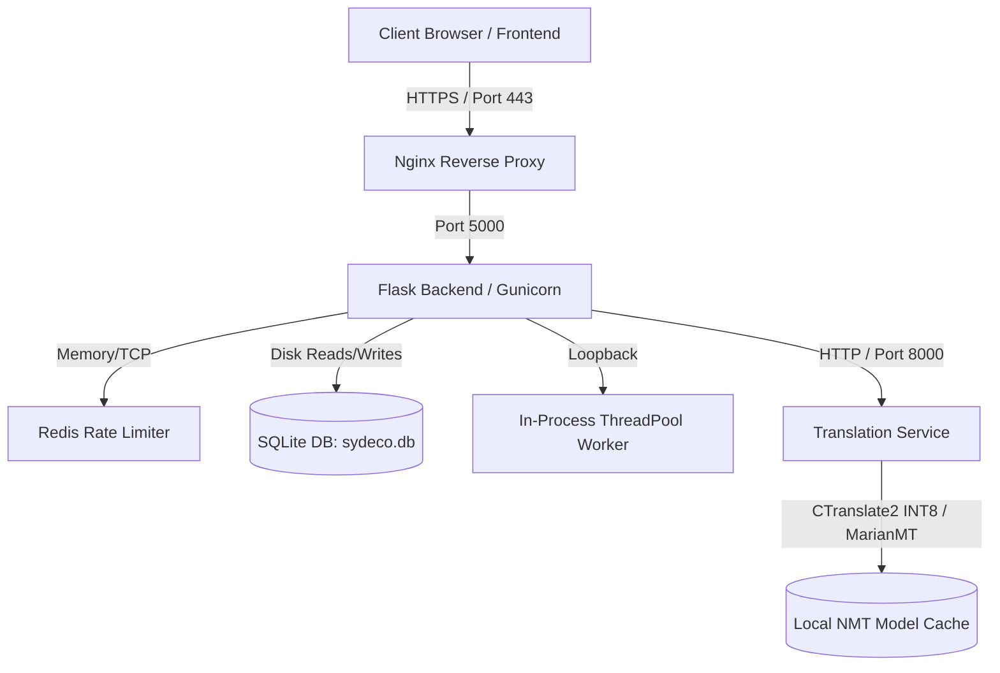

# Contract Risk Analyzer (CRA) Stack — Current State Specification

This document presents the detailed architectural blueprint, directory layout, subsystem specifications, and runtime configuration of the current **SYDECO Contract Risk Analyzer (CRA)** system.

---

## 1. System Architecture Overview

The Contract Risk Analyzer is a secure, containerized, multi-tenant contract auditing platform. It is engineered with a **local-first, privacy-respecting posture** that operates fully offline, preventing legal document assets from traversing external networks.

The system consists of four primary nodes:
1.  **Ingress & Reverse Proxy (Nginx)**: Terminates TLS, enforces security headers, and routes traffic.
2.  **App Server (Flask/Gunicorn)**: Orchestrates the analysis pipeline, handles user authentication, multi-tenant databases, audit logging, and document encryption/decryption.
3.  **Background Worker**: In-process single-thread queue (`ThreadPoolExecutor`) that processes heavy ML classification and reasoning tasks without stalling Flask workers.
4.  **Translation Microservice (MarianMT)**: Direct and pivoted translation service using optimized CTranslate2 INT8 model formats.

---

## 2. Directory Structure

Below is the recursive map of active code directories and configuration assets:

*   [datasets/](file:///mnt/c/Users/ADVAN/cra/datasets) — Reference databases compiled by legal experts:
    *   `abusive_clauses.csv`: Abusive clause keywords, impact scores, and recommendations.
    *   `dangerous_clauses.csv`: Dangerous clause indicators.
    *   `dangerous_clauses_MASTERv2.csv`: Fully merged set of dangerous clauses and additions.
    *   `illegal_clauses.csv`: Mandatory criminal/public policy violations.
    *   `leonine_clauses.csv`: Overbearing or one-sided contract clauses.
    *   `required_clauses_MASTER.csv`: Global reference library for expected clauses by contract type.
    *   `legal_citations.csv`: Localized legal code articles (BE, FR, ID, NL, US, EN&W, generic).
    *   `risk_levels.csv`: Score ranges mapping to LOW/MEDIUM/HIGH/CRITICAL categories.
*   [deploy/](file:///mnt/c/Users/ADVAN/cra/deploy) — System configuration and orchestration templates:
    *   `nginx.conf`: Hardware headers, SSL certificate routing, and Gunicorn proxy configuration.
    *   `ldv-backup.cron`: Nightly database and upload volume backup cron schedule.
    *   `setup.sh` & `gen-cert.sh`: SSL provisioning script hooks.
*   [ldv-backend/](file:///mnt/c/Users/ADVAN/cra/ldv-backend) — Primary Flask application package:
    *   `app.py`: REST routes, file ingestion, OCR checks, and process controls.
    *   `auth.py`: Cryptographic password hashing, user roles, bearer token authentication, and MFA hooks.
    *   `crypto.py`: Dynamic symmetric encryption (Fernet / AES-256) at rest for raw text and database variables.
    *   `database.py`: SQLite engine mapping tenant limits, retention times, download links, and durably written audit logs.
    *   `worker.py`: Background job consumer utilizing Python thread-pools.
    *   `pdf_report.py`: Document summary report generator utilizing ReportLab.
    *   `translator.py` & `translator_client.py`: Language gateways coordinating remote Google translate or local Translation Service.
    *   `sydeco_engine.py`: Direct rule-based backup clause classification interface.
    *   [detector/](file:///mnt/c/Users/ADVAN/cra/ldv-backend/detector) — Document scanning engine layers:
        *   `clause_db.py` & `risk_clause_db.py`: Database adapters mapping CSV rows to internal rules.
        *   `citation_db.py`: In-memory index matching citations to flagged clauses.
        *   `detector_rules.py`: Layer 1 deterministic regex rule set.
        *   `detector_distilbert.py`: Layer 2 zero-shot DistilBERT classifier.
        *   `detector_scorer.py`: Layer 3 risk scoring formulas.
        *   `detector_explain.py`: Layer 4 opt-in Qwen explanation prompts.
        *   `detector_profiles.py`: JSON contract profile manager.
    *   [scripts/](file:///mnt/c/Users/ADVAN/cra/ldv-backend/scripts) — Utility scripts:
        *   `import_datasets.py` & `train_mlp.py`: Machine learning training pipeline tools.
        *   `backup.py`: DB backup utility.
    *   [tests/](file:///mnt/c/Users/ADVAN/cra/ldv-backend/tests) — Integration and unit test cases.
*   [ldv-frontend/](file:///mnt/c/Users/ADVAN/cra/ldv-frontend) — Static single-page dashboard application:
    *   `index.html`: Client upload portal and stepper-guided analysis.
    *   `admin.html`: Organizations and User management dashboard.
    *   `citations.html`: Citation verification portal.
    *   `account.html`: User account, password, and MFA configuration page.
*   [lightml-translator/](file:///mnt/c/Users/ADVAN/cra/lightml-translator) — Offline translation service container:
    *   `app/`: Cleaner modules, PII masking, glossary lookups, and routing engines.
    *   `config/settings.py`: Port, cache sizes, and HuggingFace directories.
    *   `download_models.py`: Dependency downloader for MarianMT models.
    *   `tests/`: Marian and CTranslate2 stress test suite.
*   [uiux/](file:///mnt/c/Users/ADVAN/cra/uiux) — HTML mockups and design assets.

---

## 3. Subsystem Specifications

### 3.1. Ingestion & Security Controls
*   **Upload Limit**: Enforced at 10 MB. Files are read in chunks up to 10 MB + 1 byte; if the limit is exceeded, an HTTP 413 error is returned.
*   **MIME Validation**: Validated via `python-magic` on the first 4096 bytes. ZIP files mimicking `.docx` are resolved correctly, while malicious or renamed extensions (e.g. `.png` as `.pdf`) are rejected with HTTP 400.
*   **Rate Limiting**: Configured using `Flask-Limiter` with Redis. Capped at 10 requests/minute on `/login`, 20 requests/minute on `/upload`/`/analyze`, and 60 requests/minute default.

### 3.2. ML Core Pipeline (4 Layers)
*   **Layer 1 (Rules)**: Executes regex rules matching 7 jurisdictions and 11 clause types, followed by keyword corroboration in `risk_clause_db.py`.
*   **Layer 2 (DistilBERT)**: Translates non-English texts to English, splits them into paragraphs, and feeds them to `typeform/distilbert-base-uncased-mnli`. Labels require a confidence threshold of `0.70`.
*   **Semantic Backfill**: Promotes false negatives. Re-checks missing required clauses with semantic NLI; if text matches above `0.65`, the clause is marked present, avoiding missing-clause penalties.
*   **Layer 3 (Scorer)**: Adjusts scores using contract profiles. Critical omissions drop scores by up to 20 points, and red flags trigger deductions of 25 (HIGH) or 10 (MEDIUM) points.
*   **Layer 4 (Qwen)**: Generates detailed explanation summaries using Qwen3-1.7B, triggered with the `explain=1` parameter.

### 3.3. Isolation, Security at Rest, and Auditing
*   **Data Encryption**: AES-256 encryption via Fernet keys (`LDV_ENCRYPTION_KEY`). File uploads, extracted text, and results are encrypted before being written to disk.
*   **Purging & Retention**: Analyses are assigned an expiration date based on organizational policies. Purging is executed via `manage.py purge` (vacuuming the database to completely wipe data).
*   **Durable Audit Trails**: Key system events write to the SQLite `audit_log` table and are double-written to `audit_durable.log` in append-only mode.

### 3.4. Offline NMT Pipeline
*   **Translator microservice**: Uses Helsinki-NLP MarianMT models converted to CTranslate2 INT8 format, caching translated segments using a thread-safe LRU cache. Non-English language pairs translate by pivoting through English.

---

## 4. Hardware and Environment Configurations

*   **Host OS**: Ubuntu (WSL2 / Linux).
*   **Container Limits**:
    *   `cra-app-1`: 2.0 CPU cores, 1500 MB RAM limit.
    *   `cra-lightml-translator-1`: 2.0 CPU cores, 1000 MB RAM limit.
    *   `cra-redis-1`: 0.5 CPU cores, 256 MB RAM limit.
*   **GPU availability**: NVIDIA RTX 4050 Laptop (5 GB VRAM) is present and available via CUDA, though CPU execution is currently set as the default for compatibility.
