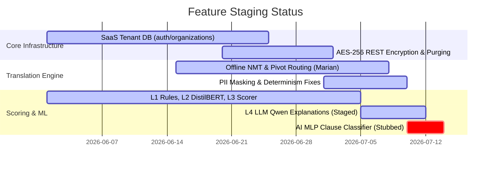

# Contract Risk Analyzer (CRA) — Gap Analysis

This document identifies gaps between the active **Contract Risk Analyzer (CRA)** system and historical **Legal Document Verifier (LDV)** specifications.

---

## 1. System Integration and Code Status

Below is the verification status of the CRA features compared to historical LDV capabilities:

---

## 2. Detailed Gap Categorization

### 2.1. Already Implemented
*   **Tenant Isolation**: Authentication via session cookies and bearer tokens, organization constraints, and MFA policies are fully implemented in `auth.py`.
*   **Security Controls**: Magic byte MIME detection, path sanitization, CORS restrictions, and rate limits are fully operational.
*   **Offline NMT Pipeline**: Direct translation and pivot routing via CTranslate2 models are fully integrated.
*   **Audit Logging**: Key events are durably recorded in SQLite and append-only log files.

### 2.2. Partially Implemented
*   **AI Clause Classifier (Layer 5)**:
    *   *Status*: `sydeco_engine.py` is configured, but `legal_mlp.pkl` is missing from the data path. The engine degrades gracefully to rule-based fallback patterns.
    *   *Remedy*: Retrain and generate the pickle file via `scripts/train_mlp.py`.

### 2.3. Missing
*   **Layer 4 Explanations (Offline Validation)**:
    *   *Status*: The prompt runner is complete, but `Qwen3-1.7B` model weights are missing from the container image, leaving tests in a *PENDING* state.
*   **PDF OCR Fallback**:
    *   *Status*: Scanned PDFs containing only images yield zero text, causing the engine to reject the file.
    *   *Remedy*: Integrate an offline OCR engine (e.g. `pytesseract` or `easyocr`) into the extraction block.

### 2.4. Deprecated
*   **Legacy `/api/v1/analyze` Route**: Bypassed by the frontend in favor of the asynchronous `/api/v1/upload` route, but maintained for curl commands and automated testing.
*   **Unsorted / Merged CSV Datasets**: `dangerous_clauses.csv`, `required_clauses.csv`, and `required_clauses_final_OPTIMAL_with_Legal_Reference.csv` have been superseded by sorted MASTER versions.

### 2.5. Dead Code & Unused Assets
*   **Presentation PPTX Files**: `Legal_Doc_Verifier_Presentation_EN.pptx`, `Legal_Doc_Verifier_Presentation_FR.pptx`, and `Legal_Doc_Verifier_Presentation_ID.pptx` in the project root are unused.
*   **Historical Zips / Backup folders**: References to historical archives are not active.
