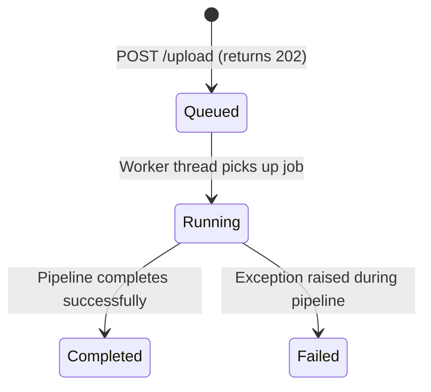

# P0 #4 — Asynchronous Job Queue Design Spec

**Date:** 2026-06-23
**Maps to:** PRD §6.1 Version 1, §13 Data Model and API Requirements, CLAUDE.md P0 #4 / CR-10.
**Status:** proposed design.

## Problem

Currently, uploading a document triggers all four layers (L1 Rules, L2 DistilBERT, L3 Scorer, L4 LLM Explanations) synchronously inside the Flask request-response cycle.
- Zero-shot classification (L2) takes 5–15 seconds on CPU.
- Qwen LLM explanation generation (L4) takes several minutes on CPU.
- During this time, the single-threaded Flask/gunicorn worker is blocked, starving concurrent requests.
- Synchronous requests are prone to client/gateway timeouts (e.g., 504 Gateway Timeout).

Confidential legal document analysis must be handled asynchronously. `/upload` must return immediately, and clients must poll/fetch status until completion.

## Decisions

1. **Lightweight In-Process Queue**: Use Python's standard library `concurrent.futures.ThreadPoolExecutor(max_workers=1)`.
   - *Rationale*: We are on a single machine with 2 CPU cores. Running multiple heavy ML/LLM pipelines concurrently will cause memory thrashing and CPU starvation. A worker pool of size 1 ensures sequential execution.
   - *Simplicity*: Avoids external dependencies (no Celery, no Redis).
2. **SQLite WAL Mode**: Configure SQLite to use Write-Ahead Logging (`PRAGMA journal_mode=WAL`).
   - *Rationale*: WAL mode allows concurrent readers (Flask threads serving API queries) and a writer (the background queue worker thread updating job state) without locking errors.
3. **Database-Backed Job State**: Store the state (`queued`, `running`, `completed`, `failed`) and errors directly in the `analyses` table.
   - *Rationale*: Simple, persistent, and survives server restarts.

## Architecture

### Database Schema Migration
Update the `analyses` table schema inside [database.py](file:///home/stardhoom/LDV/ldv-backend/database.py):

```sql
ALTER TABLE analyses ADD COLUMN status TEXT DEFAULT 'completed';
ALTER TABLE analyses ADD COLUMN error_message TEXT;
```

In `database.init_db()`, we auto-migrate older databases by adding these columns and defaulting pre-existing rows to `completed`.

### Job Life Cycle



### API Interface Changes

#### 1. `POST /upload` & `POST /analyze`
- Validates the uploaded file.
- Saves the file (encrypted via `crypto.py`).
- Creates a row in `analyses` with `status = 'queued'`.
- Enqueues the background job: `executor.submit(run_async_pipeline, public_id, ...)`
- Returns: `202 Accepted`
  ```json
  {
    "id": "<uuid>",
    "status": "queued"
  }
  ```

#### 2. `GET /api/result/<public_id>`
- Queries the analysis row.
- If status is `completed`: returns the full analysis JSON result (http status 200).
- If status is `queued` or `running`: returns `{"id": "<uuid>", "status": "queued|running", "result": null}` (http status 200).
- If status is `failed`: returns `{"id": "<uuid>", "status": "failed", "error": "<error message>", "result": null}` (http status 500 or 200).
- Standard organization-ownership permissions check still applies (returns 403 if accessed cross-organization).

## SQLite Concurrency Tuning
To prevent database locks:
1. Enable `WAL` mode: `conn.execute("PRAGMA journal_mode=WAL")` inside `_conn()`.
2. Set busy timeout: `sqlite3.connect(DB_PATH, timeout=30.0)`.
