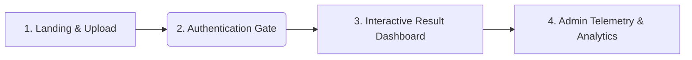

# UI/UX Design Brief: Sydeco LightML
**Role**: Product Manager  
**Target Audience**: Lead UI/UX Designer  
**Product**: Enterprise Sovereign Contract Risk Intelligence Platform  

---

## 1. Product Overview & Core Mission
**Sydeco LightML** is a secure, privacy-first SaaS platform designed to automate the review of legal contracts and corporate agreements. It helps legal counsels, compliance officers, and procurement managers quickly identify hidden liabilities, confirm the presence of mandatory clauses, and obtain structured risk scores before executing a contract.

Unlike cloud-hosted AI tools that leak sensitive corporate data, LightML operates entirely **locally** (on-premise or sovereign VPC). The interface must radiate **trust, premium authority, and absolute data control**.

---

## 2. Design Ethos: "Justice, Prestige & Scannability"
Contracts are dense and exhausting. The visual design must alleviate cognitive load while conveying institutional prestige.

### Theme & Palette
* **Theme**: Gold and Obsidian (matching both high-end dark and paper-like light environments).
* **Backdrop**: Deep, calm obsidian navy (`hsl(220, 32%, 7%)`) representing security and modern tech.
* **Accents**: Burnished gold and bronze gradients representing prestige, justice, and elite legal authority.
* **Alternative Light Mode**: Warm ivory parchment (`hsl(36, 24%, 93%)`) mimicking legal letterhead paper. 

### Typography Hierarchy
* **Headings**: Editorial, Italian-influenced Serif (`Playfair Display` or `Lora`) to evoke heritage and official document formatting.
* **Interface Text**: High-legibility, geometric Sans-serif (`Plus Jakarta Sans` or `Inter`) for tables, parameters, and form controls.

---

## 3. Core User Flow & Screens
The interface consists of four primary views. Here are the product requirements for each screen:

### Screen 1: Landing & Upload Portal
* **Objective**: Introduce the product value, host the file entrypoint, and showcase commercial pricing tiers.
* **Key Components**:
  * **Hero Header**: Editorial typeface introducing the "Sovereign legal intelligence pipeline."
  * **Drag & Drop Portal**: A clean dashed container supporting PDF, DOCX, and TXT (up to 10MB). Visual indicators should react to drag-over states using smooth card elevations.
  * **Processing Telemetry**: A live step-by-step progress loop ("Uploading...", "Running text extractors...", "Scanning compliance...") to make the local model execution feel interactive and transparent.
  * **Pricing Matrix**: A three-column grid presenting Dev, Professional, and Sovereign Enterprise tiers. The "Professional" card must have a prominent "Recommended" visual weight.

### Screen 2: Access Gate (Login Portal)
* **Objective**: Secure access to organization telemetry.
* **Key Components**:
  * A central glassmorphic card with form inputs (email, password) and clear input labels.
  * Loading state feedback on the sign-in button ("Signing in...").
  * A shake animation on the card if the backend returns invalid credentials.

### Screen 3: Interactive Risk Dashboard (Split-Layout)
* **Objective**: Present dense analytical findings in a highly readable, non-threatening format.
* **Layout**: A responsive split layout:
  * **Left Column (Summary & Recommendations)**:
    * **Risk Hero Panel**: A large circular progress ring displaying the risk score (0-100) with a sweep-animation on load. Background glows should dynamically change based on risk severity (Sage for Low, Gold for Medium, Crimson for High, Burgundy for Critical).
    * **Action Items**: A list of key steps legal counsel must take (e.g., "Add a unilateral termination clause"). Standard text bullets (`→`) are banned; use custom info-circle SVGs.
  * **Right Column (Metadata & Details Accordions)**:
    * **Profile Grid**: Fast metadata details (filename, file type, file size, organization, analysis date).
    * **Clause Checklist**: Displays mandatory legal parameters (e.g., "Force Majeure", "Governing Law") with clean vector checkmarks and required badges.
    * **Risks & Abusive Clauses**: The most critical cards on the page. Highlights leonine clauses with suggested, safe legal rewrites in side-by-side blocks.
    * **Scoring Penalty Table**: A breakdown showing where the contract lost points (e.g., "-15 points for missing Arbitration clause").
    * **Extracted Text Pane**: A clean, scrollable preformatted block containing the raw string extracted from the document.

### Screen 4: Admin Analytics & History Dashboard
* **Objective**: System-wide operations overview for operations teams.
* **Key Components**:
  * **Telemetry Grid**: Key metrics showing Stored Documents, Total Analyses, Average Risk Index, and Risky Agreements.
  * **Risk Class Distribution**: Bar distributions displaying risk classification patterns (LOW, MEDIUM, HIGH, CRITICAL).
  * **Historical Reports Table**: A comprehensive, filterable list of all processed agreements. Clicking a row navigates directly to that document's result panel.

---

## 4. Key Design Guidelines for the Designer

* **No Emojis**: Do not use standard emoji characters (like ⚠️ or 📄) inside layout cards. All indicators must use lightweight SVG vector icons (such as Lucide or Heroicons) that scale accurately.
* **Smooth CSS Transitions**: Accordion expansions, chevron rotations, theme toggles, and circular progress fills must be transition-animated with standard cubic-bezier curves for a premium tactile feel.
* **Responsive Breakpoints**: Ensure all layouts cleanly stack from wide desktop displays (1440px) down to mobile phones (375px) without cropping columns or overflowing text bounds.
* **Print Accessibility**: The result page styling must include print directives ensuring that exporting to PDF prints a clean, two-page legal diagnostic report without backgrounds or buttons.
